# Admin Flows

## Overview

This document details the primary user flows for administrators in the Workday & Ticket Tracking PWA. It outlines the step-by-step processes for key administrative actions like filtering and exporting data, managing reference data (jobsites and trucks), and overseeing user accounts. These flows are designed for the 1-2 internal managers who oversee the system and generate reports.

## Table of Contents

```table-of-contents
```

## Authentication Flow

Administrators use the same authentication endpoint as employees but receive different permissions based on their role.

### Admin Login Process

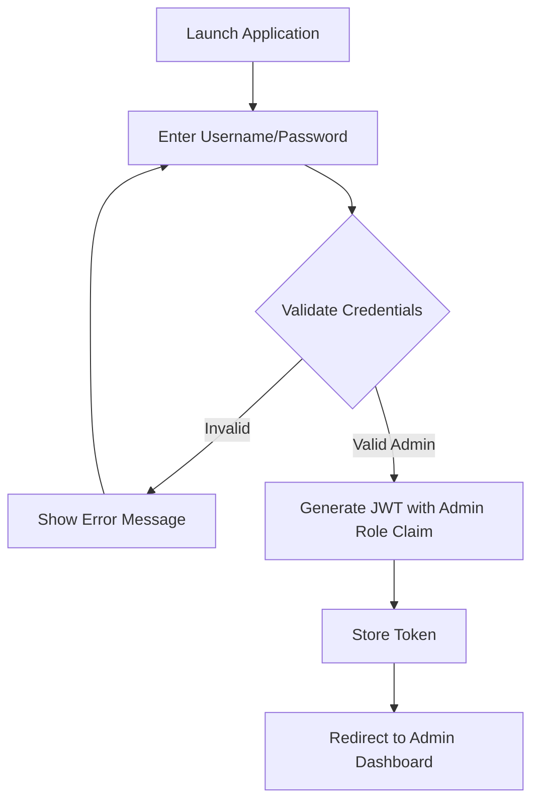

#### Implementation Details

1. **API Endpoint**: `POST /api/auth/login`
2. **Request Payload**:
   ```json
   {
     "username": "string",
     "password": "string"
   }
   ```
3. **Authentication Method**: Custom Firebase Auth with JWT tokens
4. **Token Storage**: In-memory storage with limited persistence for security
5. **Role-Based Access**: Token includes `role: "admin"` claim
6. **Security**: Additional security rules prevent role escalation

#### User Experience

1. Admin opens the application (typically on desktop, but mobile-compatible)
2. If no valid session exists, they're presented with the login screen
3. Admin enters username and password
4. On successful authentication with admin role:
   - A success animation briefly appears
   - Admin is redirected directly to the dashboard view with bento layout
   - Admin sidebar navigation becomes available
5. On failed authentication:
   - Error message appears below the login form
   - Input fields are highlighted in red
   - Password field is cleared for security

## Dashboard & Navigation

### Bento Dashboard Layout

The admin dashboard uses a bento-style layout with customizable visualization cards, providing a comprehensive overview at a glance.

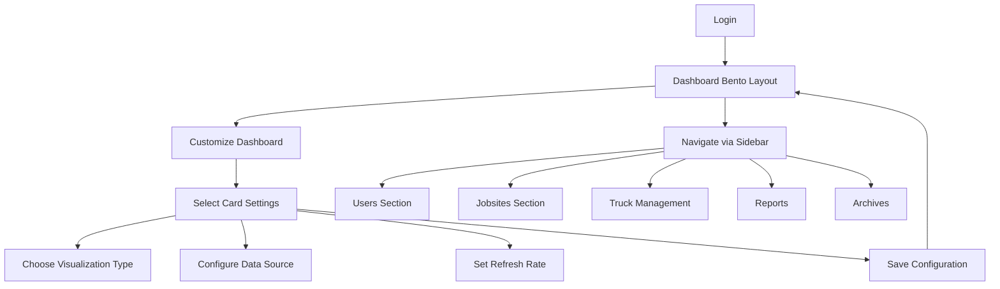

#### Implementation Details

1. **Dashboard Configuration**:
   - User-specific dashboard layout stored in Firestore
   - Drag-and-drop card positioning with react-grid-layout
   - Card settings saved with each visualization
2. **Chart Types**:
   - Line charts, bar charts, pie charts, area charts
   - Data tables with summary statistics
   - Heat maps for activity visualization
   - Counter cards for numeric KPIs
3. **Data Refresh**:
   - Configurable refresh intervals (real-time to daily)
   - React Query for efficient data fetching
   - Automatic refresh on navigation return

#### User Experience

1. Admin logs in and is presented with a bento-style dashboard layout
2. Dashboard contains multiple cards showing different visualizations:
   - Active users today
   - Tickets submitted this week (with category breakdown)
   - Workday distribution by jobsite
   - Truck activity heatmap
   - System status indicators
3. Each card has a settings button in the top right corner
4. Admin can customize each card:
   - Click settings to open configuration panel
   - Select visualization type (chart, counter, table, etc.)
   - Choose data source and filters
   - Set refresh interval
   - Save configuration
5. Admin can:
   - Drag cards to rearrange dashboard layout
   - Resize cards for more detailed view
   - Add new visualization cards
   - Remove unused cards
6. Sidebar navigation provides access to all admin sections:
   - Users management
   - Jobsites management
   - Truck management
   - Reports
   - Archives
   - Settings

### Navigation & Table Interactions

All admin screens follow consistent patterns for filtering, sorting, and exporting data.

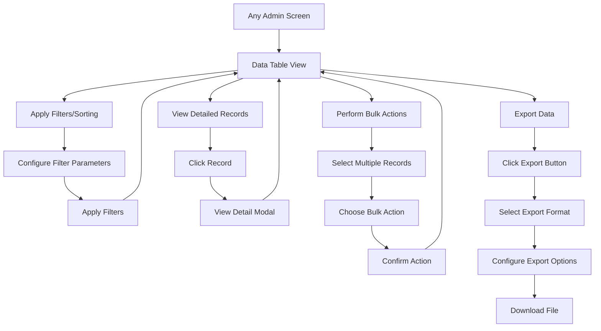

#### Implementation Details

1. **Table Components**:
   - Feature-rich data grid with TanStack Table
   - Server-side pagination, sorting, and filtering
   - Selection mechanisms for bulk actions
2. **Export Options**:
   - Excel export (default)
   - CSV export
   - PDF export (for reports)
   - Customizable columns and data range
3. **Filtering Capabilities**:
   - Text search with column specificity
   - Date range filtering
   - Categorical filters (dropdowns, multi-select)
   - Advanced filter composition (AND/OR conditions)

#### User Experience

1. Every admin screen with tabular data follows a consistent pattern:
   - Robust filtering options at the top
   - Clear table layout with sortable columns
   - Selection checkboxes for bulk actions
   - Export button in the toolbar
   - Add/Edit/Delete actions where appropriate
2. Admin can easily filter data:
   - Use quick filters for common scenarios
   - Open advanced filter panel for complex queries
   - Save and recall favorite filters
   - Clear all filters with one click
3. Admin can sort data by clicking column headers:
   - First click: ascending order
   - Second click: descending order
   - Third click: default order
4. Admin can select records for bulk actions:
   - Individual checkboxes
   - "Select All" checkbox in header
   - "Select Visible" option
   - "Invert Selection" option
5. Admin can export data in multiple formats:
   - Click Export button
   - Select format (Excel, CSV, PDF)
   - Choose export options:
     - Which columns to include
     - Data range (all or selected)
     - Include summary statistics
     - Custom filename
   - Download generated file

## Data Management & Filtering Flows

### Filter & View Workdays

This flow allows administrators to filter and view workday entries across all employees.

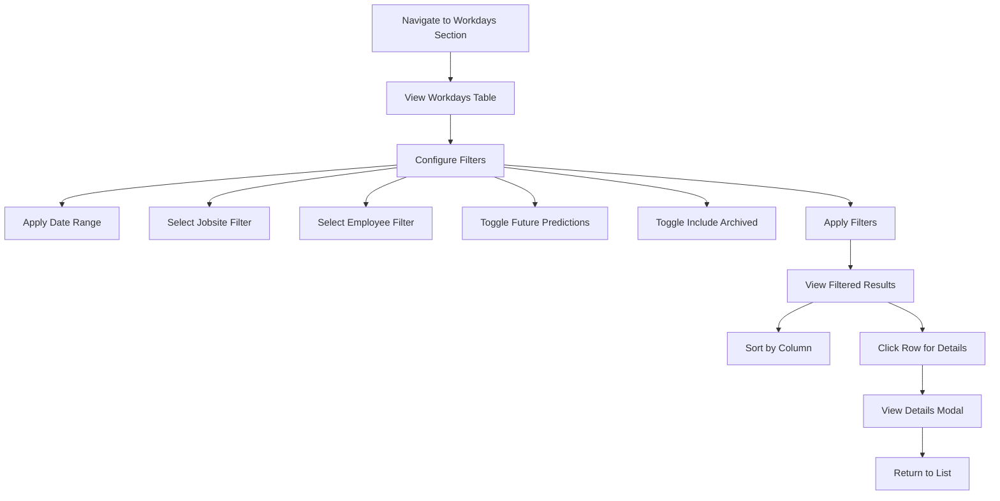

#### Implementation Details

1. **API Endpoint**: `GET /api/admin/workdays`
2. **Query Parameters**:
   ```
   startDate: ISO date string
   endDate: ISO date string
   jobsite: (optional) Filter by jobsite ID
   userId: (optional) Filter by employee username
   includeFuturePredictions: Boolean (default: true)
   includeArchived: Boolean (default: false)
   ```
3. **Data Loading**: React Query with filter-based cache keys
4. **UI Components**: Data grid with sorting and filtering capabilities

#### User Experience

1. Admin navigates to the Workdays section from the sidebar
2. Filter panel appears with the following options:
   - Date range picker (defaulted to current month)
   - Jobsite dropdown (multi-select capability)
   - Employee dropdown (multi-select capability)
   - Toggle switches for:
     - Include future predictions
     - Include archived records
3. Admin configures desired filters and clicks "Apply"
4. Results appear in a data grid with columns:
   - Date
   - Employee
   - Jobsite
   - Work Type (with color indicators)
   - Status (Active/Archived)
5. Admin can:
   - Sort by clicking column headers
   - Click a row to view full details
   - Adjust filters and reapply
   - Export filtered data to Excel/CSV with one click
6. The details modal shows all information about the selected workday
7. Admin can close the modal to return to the filtered list

### Filter & Export Truck Tickets

This flow allows administrators to filter tickets by truck and date range, then export to Excel.

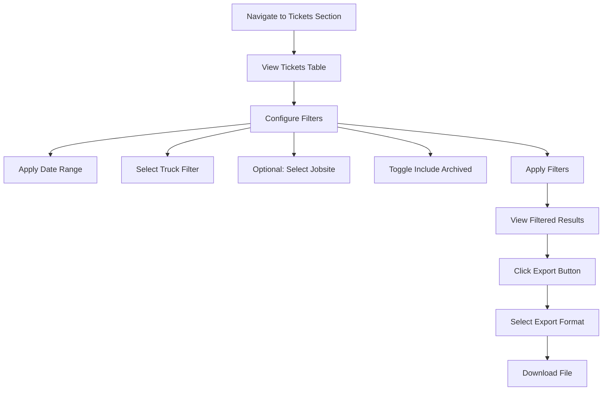

#### Implementation Details

1. **API Endpoints**: 
   - Filter: `GET /api/admin/tickets`
   - Export: `GET /api/admin/export/tickets`
2. **Query Parameters**:
   ```
   startDate: ISO date string
   endDate: ISO date string
   truckNumber: (optional) Filter by truck ID
   jobsite: (optional) Filter by jobsite ID
   includeFuturePredictions: Boolean (default: true)
   includeArchived: Boolean (default: false)
   includeInProgress: Boolean (default: false)
   ```
3. **Export Process**: Server-side generation with multiple format options
4. **File Formats**: XLSX, CSV, PDF

#### User Experience

1. Admin navigates to the Tickets section from the sidebar
2. Filter panel appears with the following options:
   - Date range picker (defaulted to current month)
   - Truck dropdown (multi-select capability)
   - Jobsite dropdown (multi-select capability)
   - Toggle switches for:
     - Include future predictions
     - Include archived records
     - Include in-progress submissions
3. Admin selects:
   - Specific date range (e.g., previous week)
   - Specific truck (e.g., "Truck-12")
   - Optionally, specific jobsite(s)
4. Admin clicks "Apply" to view filtered results
5. Results appear in a data grid with columns:
   - Date
   - Employee
   - Truck (with ID and nickname)
   - Jobsite
   - Total Tickets
   - Categories breakdown
   - Status
6. Admin clicks "Export" button in the toolbar
7. Export options appear:
   - Excel format (default)
   - CSV format
   - PDF format
8. Admin selects format and export options
9. File downloads to the admin's device with a name pattern like:
   `tickets-Truck12-2025-03-01-to-2025-03-07.xlsx`

### View & Manage In-Progress Tickets

This flow allows administrators to monitor and manage tickets that employees have started but not completed.

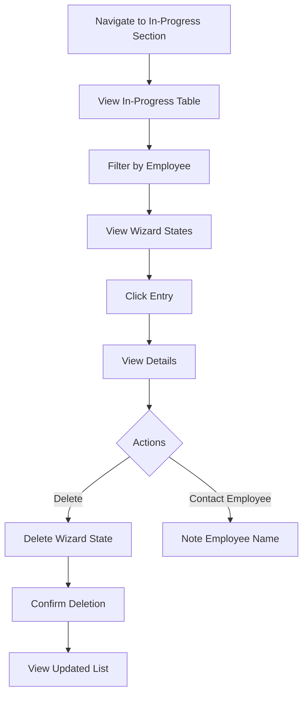

#### Implementation Details

1. **API Endpoint**: `GET /api/admin/tickets/in-progress`
2. **Query Parameters**:
   ```
   userId: (optional) Filter by employee username
   ```
3. **Delete Endpoint**: `DELETE /api/admin/tickets/wizard/{wizardId}`
4. **UI Components**: Data grid with expandable rows

#### User Experience

1. Admin navigates to the In-Progress section from the sidebar
2. List of wizard state entries appears showing:
   - Employee name
   - Time started
   - Current step (1-4)
   - Last update time
   - Expiration time
3. Admin can filter the list by employee
4. Admin clicks an entry to view details:
   - Progress summary
   - Basic information (if completed)
   - Categories (if completed)
   - Image count (if completed)
5. Admin can:
   - Delete the entry if it seems abandoned
   - Export the list for follow-up
6. Deletion requires confirmation to prevent accidents
7. After deletion, the list updates automatically

## Reference Data Management Flows

### Jobsite Management

This flow allows administrators to create, edit, and delete jobsites.

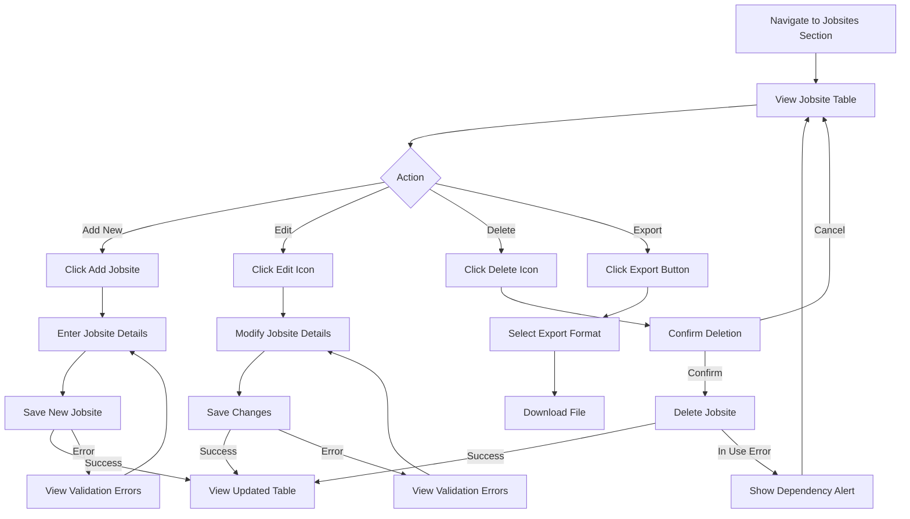

#### Implementation Details

1. **API Endpoints**:
   - List: `GET /api/admin/jobsites`
   - Create: `POST /api/admin/jobsites`
   - Update: `PUT /api/admin/jobsites/{id}`
   - Delete: `DELETE /api/admin/jobsites/{id}`
   - Export: `GET /api/admin/export/jobsites`
2. **Data Requirements**:
   ```json
   {
     "id": "site-6",
     "name": "East Branch"
   }
   ```
3. **Validation Rules**:
   - ID must be unique and follow pattern
   - Name is required
4. **Dependency Check**: Cannot delete jobsites used in workdays or tickets

#### User Experience

1. Admin navigates to the Jobsites section from the sidebar
2. Table of jobsites appears showing:
   - ID
   - Name
   - Creation date
   - Created by
   - Action buttons (Edit, Delete)
3. Admin can instantly filter/sort the table:
   - Filter by text in any column
   - Sort by clicking column headers
   - Export the current view with one click
4. To add a new jobsite:
   - Admin clicks "Add Jobsite" button
   - Modal dialog appears with form
   - Admin enters ID and name
   - Admin clicks "Save" to create
   - Success message appears on completion
5. To edit a jobsite:
   - Admin clicks edit icon on the row
   - Modal dialog appears with pre-filled form
   - Admin modifies fields as needed
   - Admin clicks "Save" to update
   - Success message appears on completion
6. To delete a jobsite:
   - Admin clicks delete icon on the row
   - Confirmation dialog appears
   - If jobsite is not in use, deletion succeeds
   - If jobsite is in use, error message details dependencies
7. To export jobsite data:
   - Admin clicks "Export" button
   - Selects format (Excel, CSV)
   - Downloads file with all jobsite data

### Truck Management

This flow allows administrators to create, edit, and delete trucks.

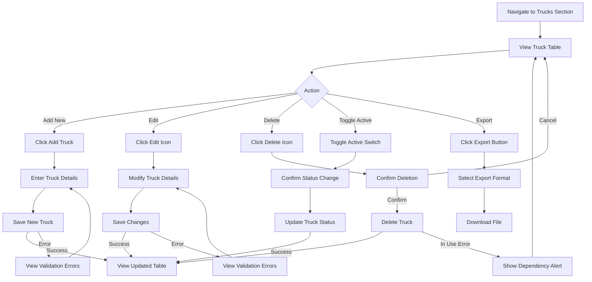

#### Implementation Details

1. **API Endpoints**:
   - List: `GET /api/admin/trucks`
   - Create: `POST /api/admin/trucks`
   - Update: `PATCH /api/admin/trucks/{id}`
   - Delete: `DELETE /api/admin/trucks/{id}`
   - Export: `GET /api/admin/export/trucks`
2. **Data Requirements**:
   ```json
   {
     "id": "Truck-14",
     "nickname": "Green Machine",
     "isActive": true
   }
   ```
3. **Validation Rules**:
   - ID must be unique and follow pattern
   - Nickname is required
4. **Dependency Check**: Cannot delete trucks used in tickets

#### User Experience

1. Admin navigates to the Trucks section from the sidebar
2. Table of trucks appears showing:
   - ID
   - Nickname
   - Active status (toggle switch)
   - Creation date
   - Action buttons (Edit, Delete)
3. Admin can instantly filter/sort the table:
   - Filter by text in any column
   - Sort by clicking column headers
   - Toggle to show only active trucks
   - Export the current view with one click
4. To add a new truck:
   - Admin clicks "Add Truck" button
   - Modal dialog appears with form
   - Admin enters ID, nickname, and active status
   - Admin clicks "Save" to create
   - Success message appears on completion
5. To edit a truck:
   - Admin clicks edit icon on the row
   - Modal dialog appears with pre-filled form
   - Admin modifies fields as needed
   - Admin clicks "Save" to update
   - Success message appears on completion
6. To toggle active status:
   - Admin clicks the toggle switch in the row
   - Confirmation appears if deactivating a truck
   - Status updates immediately on confirmation
7. To delete a truck:
   - Admin clicks delete icon on the row
   - Confirmation dialog appears
   - If truck is not in use, deletion succeeds
   - If truck is in use, error message details dependencies
8. To export truck data:
   - Admin clicks "Export" button
   - Selects format (Excel, CSV)
   - Downloads file with all truck data

## User Management Flows

### User Administration

This flow allows administrators to manage employee accounts.

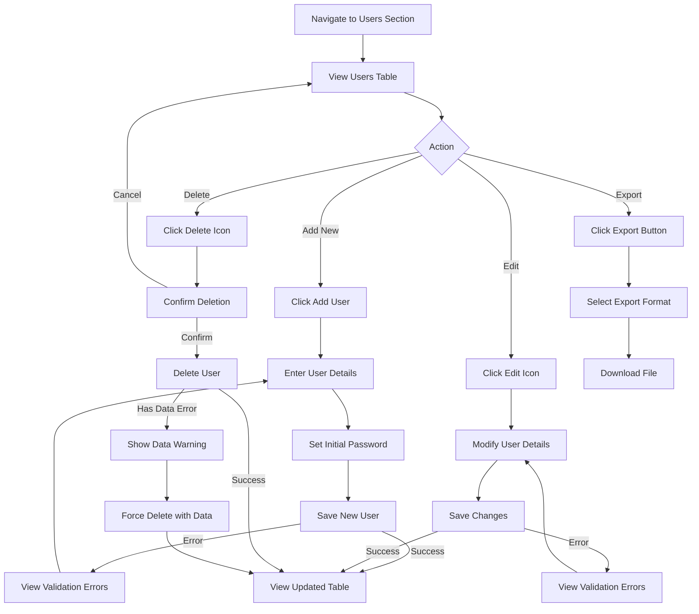

#### Implementation Details

1. **API Endpoints**:
   - List: `GET /api/admin/users`
   - Create: `POST /api/admin/users`
   - Update: `PUT /api/admin/users/{username}`
   - Delete: `DELETE /api/admin/users/{username}`
   - Export: `GET /api/admin/export/users`
2. **Data Requirements**:
   ```json
   {
     "username": "janedoe",
     "password": "securepassword",
     "userRole": "employee",
     "animationPrefs": {
       "reducedMotion": false,
       "hapticFeedback": true
     }
   }
   ```
3. **Validation Rules**:
   - Username must be unique
   - Password must meet security requirements
   - Role must be "employee" or "admin"
4. **Security**: Only admins can create other admin users

#### User Experience

1. Admin navigates to the Users section from the sidebar
2. Table of users appears showing:
   - Username
   - Role
   - Creation date
   - Created by
   - Action buttons (Edit, Delete)
3. Admin can instantly filter/sort the table:
   - Filter by text in any column
   - Sort by clicking column headers
   - Filter by role type
   - Export the current view with one click
4. To add a new user:
   - Admin clicks "Add User" button
   - Modal dialog appears with form
   - Admin enters username, password, role, and preferences
   - Admin clicks "Save" to create
   - Success message appears on completion
5. To edit a user:
   - Admin clicks edit icon on the row
   - Modal dialog appears with pre-filled form
   - Admin modifies fields as needed
   - Admin clicks "Save" to update
   - Success message appears on completion
6. To delete a user:
   - Admin clicks delete icon on the row
   - Confirmation dialog appears
   - If user has data, warning shows with option to force delete
   - On confirmation, user is deleted from system
7. To export user data:
   - Admin clicks "Export" button
   - Selects format (Excel, CSV)
   - Downloads file with user data (passwords excluded)

## Reports Section

The Reports section allows administrators to generate, view, customize, and export various analytical reports.

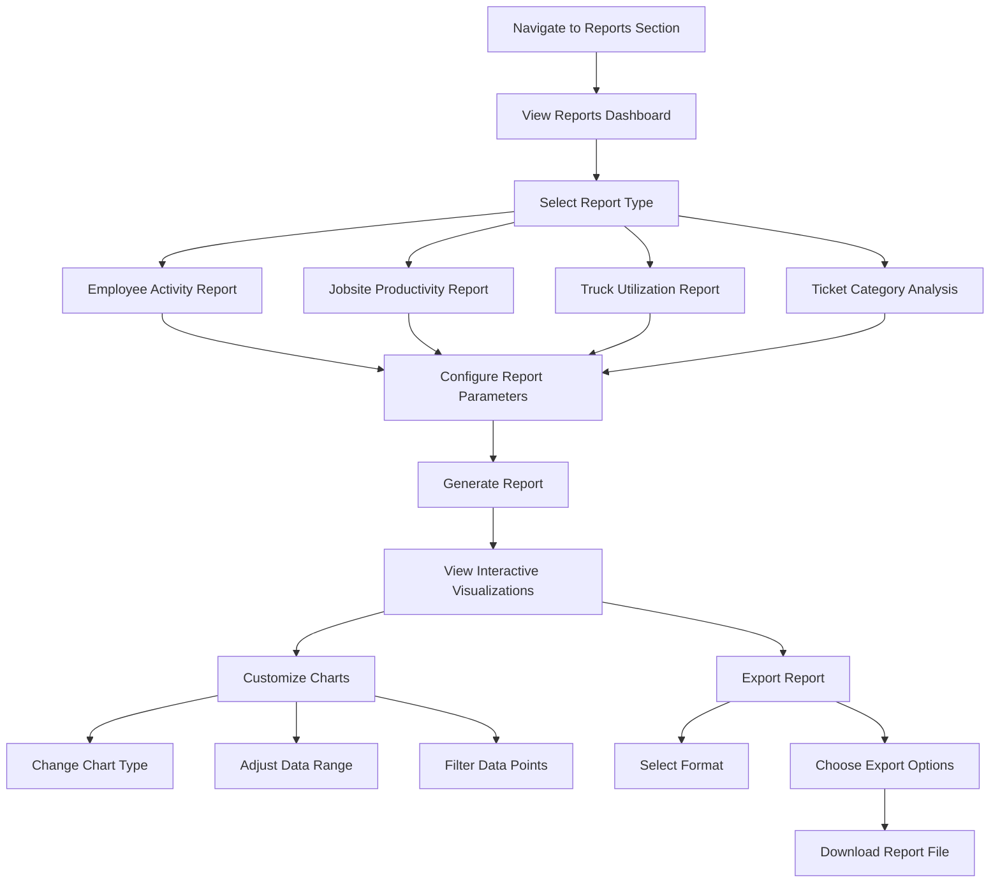

#### Implementation Details

1. **API Endpoints**:
   - Report Data: `GET /api/admin/reports/{reportType}`
   - Export: `GET /api/admin/reports/{reportType}/export`
2. **Report Types**:
   - Employee Activity: Workdays and tickets by employee
   - Jobsite Productivity: Activity metrics by jobsite
   - Truck Utilization: Usage statistics for each truck
   - Ticket Category Analysis: Breakdown of ticket categories over time
3. **Chart Types**:
   - Line charts for time-series data
   - Bar charts for comparative analysis
   - Pie/donut charts for distribution analysis
   - Heat maps for density visualization
4. **Export Options**:
   - Excel with embedded charts
   - CSV for raw data
   - PDF for formatted reports
   - PNG for individual chart export

#### User Experience

1. Admin navigates to the Reports section from the sidebar
2. Reports dashboard shows available report types:
   - Employee Activity Report
   - Jobsite Productivity Report
   - Truck Utilization Report
   - Ticket Category Analysis
3. Admin selects a report type to view
4. Configuration panel appears with:
   - Date range selection
   - Filtering options specific to the report type
   - Grouping options (daily, weekly, monthly)
   - Comparison options (year-over-year, month-over-month)
5. Admin configures parameters and clicks "Generate"
6. Interactive visualizations appear showing the report data:
   - Primary chart with the main dataset
   - Supporting charts showing related metrics
   - Summary statistics in card format
   - Data table with detailed figures
7. Admin can customize visualizations:
   - Change chart type using dropdown
   - Toggle data series on/off
   - Adjust axis scales
   - Apply additional filters
8. Admin can export the report:
   - Click "Export" button
   - Select format (Excel, CSV, PDF)
   - Choose export options:
     - Include all visualizations
     - Include data tables
     - Include summary statistics
   - Download the generated report file

## Dashboard Customization

This flow allows administrators to customize their bento-style dashboard layout and visualizations.

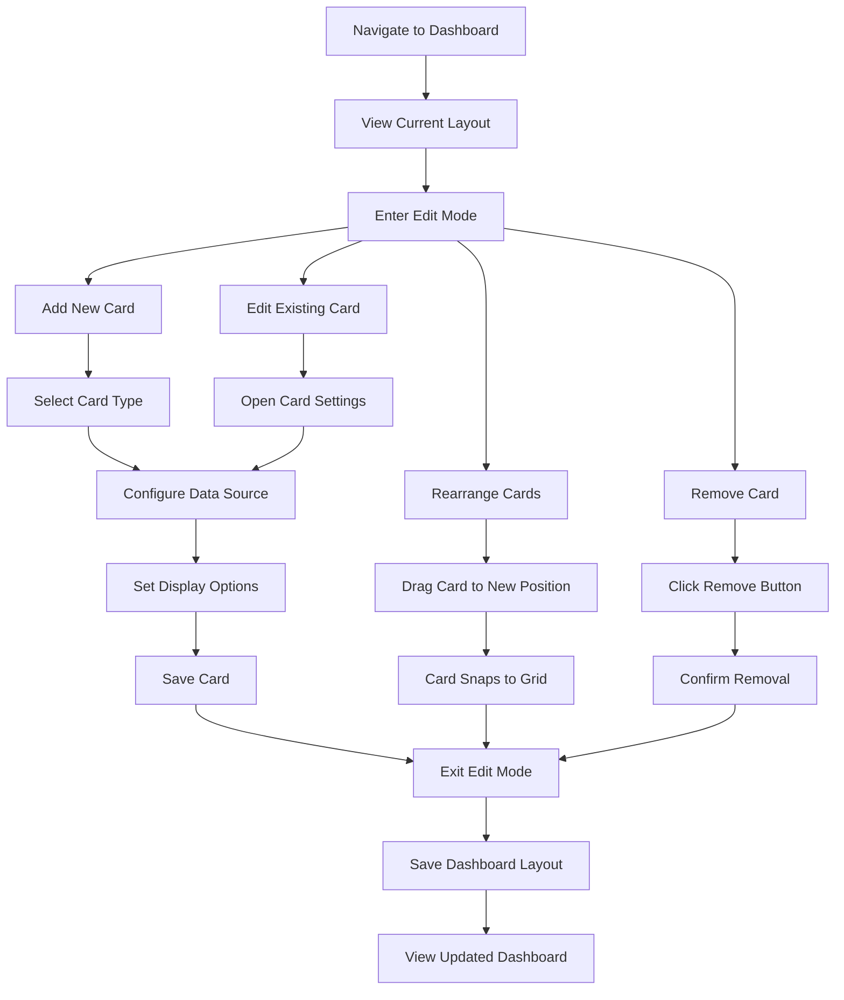

#### Implementation Details

1. **API Endpoints**:
   - Get Layout: `GET /api/admin/dashboard`
   - Save Layout: `PUT /api/admin/dashboard`
   - Card Data: `GET /api/admin/dashboard/card/{cardType}`
2. **Dashboard Storage**:
   - User-specific layout stored in Firestore
   - Card configurations saved with layout
   - Default layout provided for new users
3. **Card Types**:
   - Chart cards (line, bar, pie, etc.)
   - Metric cards (KPI counters)
   - Table cards (data grids)
   - Status cards (system health)
   - Activity cards (recent events)

#### User Experience

1. Admin navigates to the dashboard
2. Current dashboard layout appears with various cards in a bento layout
3. Admin clicks "Customize Dashboard" button to enter edit mode
4. In edit mode, admin can:
   - See a grid overlay for alignment
   - Drag cards to rearrange them
   - Resize cards using handles
   - See edit/remove buttons on each card
5. To add a new card:
   - Admin clicks "Add Card" button
   - Card type selection appears:
     - Chart Card
     - Metric Card
     - Table Card
     - Status Card
     - Activity Card
   - Admin selects type and clicks "Add"
   - Empty card appears in layout
   - Configuration panel opens automatically
6. To edit a card:
   - Admin clicks settings icon on the card
   - Configuration panel slides in from side
   - Options include:
     - Data source selection
     - Chart type (for chart cards)
     - Time range
     - Refresh interval
     - Display options (colors, labels, etc.)
   - Admin makes changes and clicks "Save"
   - Card updates immediately with new settings
7. To remove a card:
   - Admin clicks remove icon on the card
   - Confirmation dialog appears
   - Admin confirms removal
   - Card disappears and layout adjusts
8. When finished editing:
   - Admin clicks "Save Layout" button
   - Success message confirms save
   - Edit mode is exited
   - Dashboard appears with new layout

## Related Resources

- [[1. Core Documentation/Technical_Specifications|Technical Specifications]]: High-level technical architecture
- [[2. Frontend Documentation/Frontend_Architecture|Frontend Architecture]]: Detailed frontend design
- [[3. Backend Documentation/API_Reference|API Reference]]: Complete API endpoint details
- [[3. Backend Documentation/Data_Models_Schema|Data Models & Schema]]: Data structures supporting these flows
- [[3. Backend Documentation/Data_Archiving|Data Archiving]]: Archiving process details
- [[1. Core Documentation/Employee_Flows|Employee Flows]]: Field worker workflows

## Document Information

**Status:** Draft  
**Last Updated:** 2025-03-13  
**Author/Maintainer:** Development Team
