# Employee Flows

## Overview

This document details the primary user flows for field employees in the Workday & Ticket Tracking PWA. It outlines the step-by-step processes for key actions like logging workdays and submitting tickets, providing both technical implementation details and the user experience perspective. These flows are designed to be mobile-first, supporting the 30 field workers who are the primary users of the application.

## Table of Contents

```table-of-contents
```

## Authentication Flow

Before accessing any functionality, employees must authenticate to the system.

### Login Process

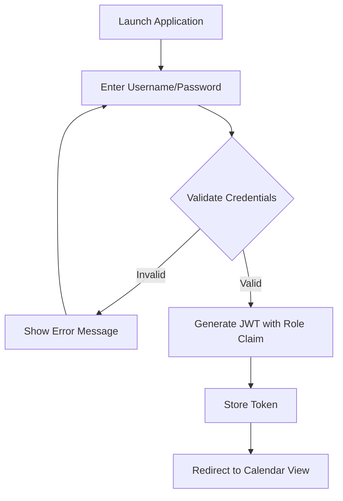

#### Implementation Details

1. **API Endpoint**: `POST /api/auth/login`
2. **Request Payload**:
   ```json
   {
     "username": "string",
     "password": "string"
   }
   ```
3. **Authentication Method**: Custom Firebase Auth with JWT tokens
4. **Token Storage**: In-memory storage with limited persistence for security
5. **Role-Based Access**: Token includes `role: "employee"` claim

#### User Experience

1. User opens the application on their mobile device
2. If no valid session exists, they're presented with a login screen
3. User enters their username and password (provided by admin)
4. On successful authentication:
   - A success animation briefly appears
   - User is redirected directly to the calendar view
5. On failed authentication:
   - Error message appears below the login form
   - Input fields are highlighted in red
   - Password field is cleared for security

## Workday Logging Flow

Employees use this flow to mark days as full, half, or off days with associated jobsite information.

### Workday Submission

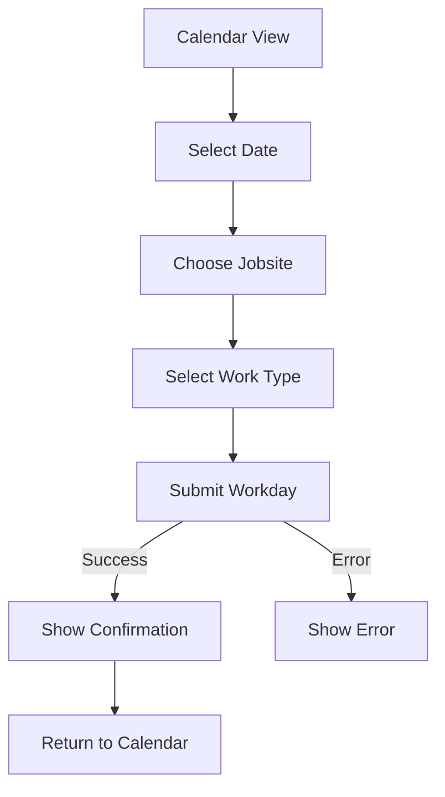

#### Implementation Details

1. **API Endpoint**: `POST /api/workdays`
2. **Request Payload**:
   ```json
   {
     "date": "2025-03-15T00:00:00.000Z",
     "jobsite": "site-5",
     "workType": "full" // "full", "half", or "off"
   }
   ```
3. **Data Validation**:
   - Date cannot be more than 5 days in the future
   - Jobsite must be a valid ID from the jobsites collection
   - Work type must be one of the allowed values
4. **Database Updates**:
   - New record created in `workdays` collection
   - `editableUntil` field set to current date + 7 days

#### User Experience

1. User lands directly on the Calendar view after login
2. Calendar displays current month with color-coded days:
   - White: No data
   - Green: Full day
   - Yellow: Half day
   - Red: Off day
   - **Ticket Indicator**: Days with submitted tickets show a small ticket icon
3. User taps on a date to log or edit workday
4. Jobsite selection:
   - Bottom sheet slides up with scrollable list of jobsites
   - User selects appropriate jobsite
   - Sheet closes with selection displayed
5. Work type selection:
   - User taps on "Full Day", "Half Day", or "Off Day" button
   - Selected option highlights with appropriate color
6. User taps "Save" to submit
7. Confirmation:
   - Success animation (checkmark with haptic feedback)
   - Calendar updates with new color for the date
   - Sheet dismisses automatically

### Workday Editing

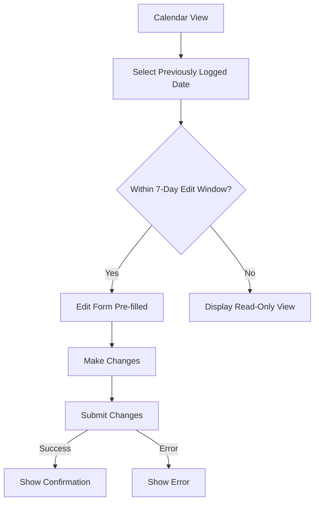

#### Implementation Details

1. **Edit Window Calculation**: Current date compared to `editableUntil` field
2. **API Endpoint**: `PUT /api/workdays/{id}`
3. **Request Payload**:
   ```json
   {
     "jobsite": "site-5",
     "workType": "half"
   }
   ```
4. **Security Checks**:
   - Verify user is the owner of the workday entry
   - Verify edit window hasn't expired
5. **Database Updates**: Update fields in the existing document

#### User Experience

1. User taps on a previously logged day in the calendar
2. If within 7-day edit window:
   - Sheet opens with current values pre-selected
   - Edit interface is identical to creation interface
   - "Save Changes" button appears at bottom
3. If outside 7-day window:
   - Read-only view shows current values
   - "Edit Disabled" message appears with explanation
   - No save button is available
4. On successful edit:
   - Success animation appears
   - Calendar updates with new color if work type changed
   - Sheet dismisses automatically

### Viewing Day Details with Tickets

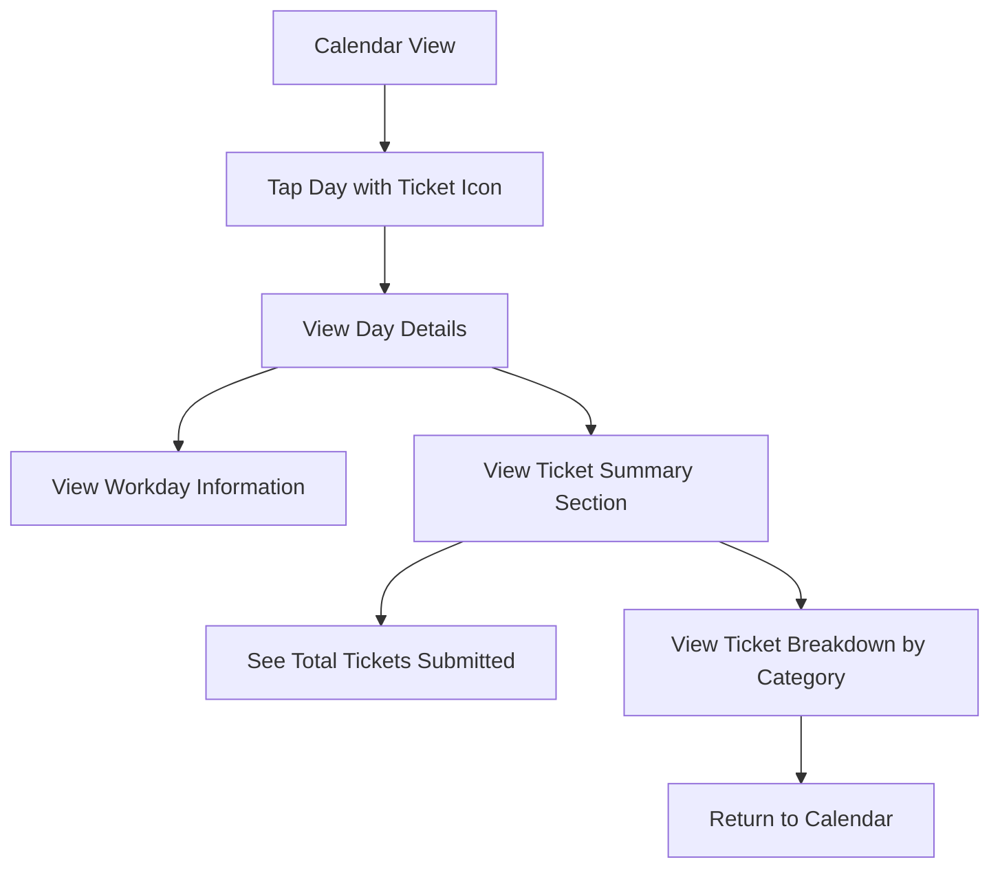

#### Implementation Details

1. **API Endpoint**: `GET /api/workdays/{date}`
2. **Additional Data**: Includes ticket summary data when available
3. **UI Components**: Expandable sections for workday and ticket information

#### User Experience

1. User sees ticket icon on days where tickets were submitted
2. Tapping on a day with the ticket icon shows an enhanced day detail view:
   - Standard workday information (jobsite, work type)
   - Additional "Tickets" section showing:
     - Total number of tickets submitted that day
     - Breakdown by ticket category (hangers, leaners, etc.)
     - Associated truck information
3. User can easily return to the calendar by tapping outside the detail view
4. The ticket information is read-only in this context

## Navigation Between Calendar and Tickets

A simple navigation method allows employees to switch between the calendar and tickets views.

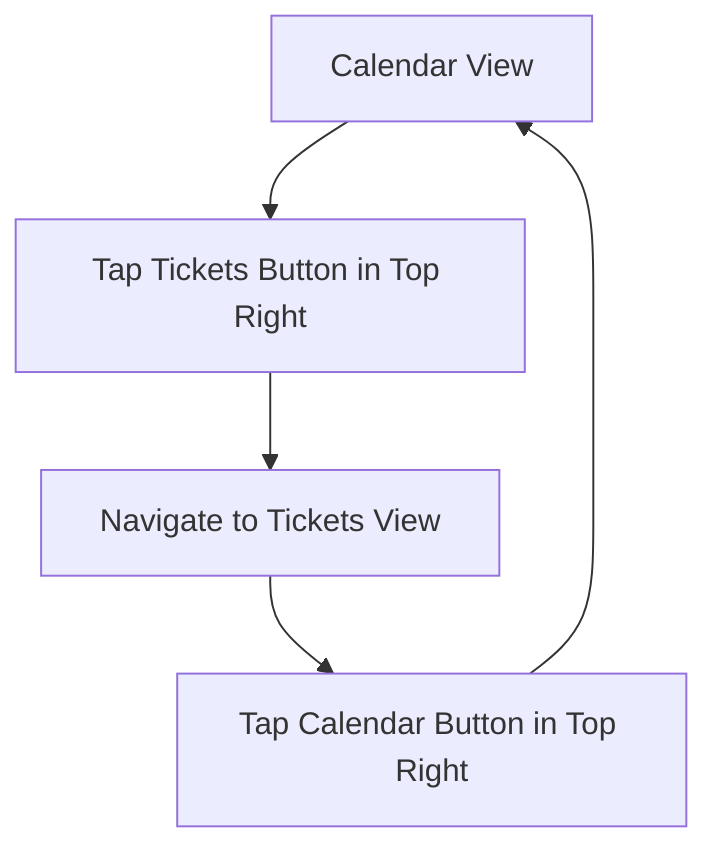

#### Implementation Details

1. **Navigation Method**: Direct route change via Next.js router
2. **State Preservation**: Page state preserved during navigation

#### User Experience

1. User sees a simple button in the top right corner of the Calendar view:
   - Small "Tickets" button with ticket icon
   - Button is visible to all employees
2. Tapping the button transitions to the Tickets view
3. In the Tickets view:
   - Small "Calendar" button with calendar icon appears in top right
   - Tapping returns user to the Calendar view
4. Transitions are smooth with minimal animations
5. Each view preserves its state when navigating between them

## Ticket Submission Wizard Flow

The ticket submission process follows a 4-step wizard pattern with rich micro-interactions to guide the user through the complex form.

### Multi-Step Submission Overview

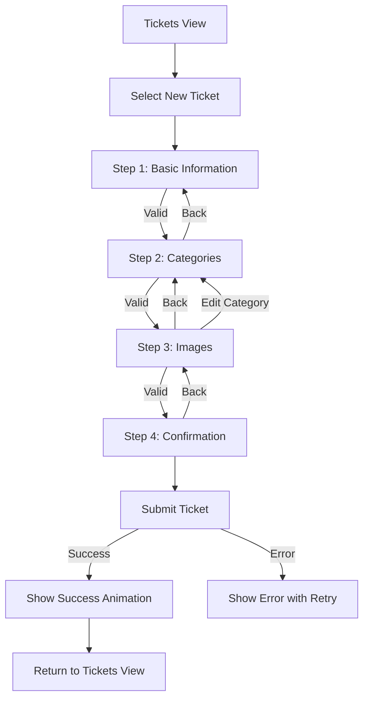

#### Implementation Details

1. **Wizard State Management**:
   - Global state managed by Zustand
   - Persisted in localStorage with 24-hour expiration
   - Optional server-side backup for session recovery
2. **Validation**: Each step has specific validation rules that must pass before proceeding
3. **API Endpoints**:
   - Step 1: `POST /api/tickets/wizard/step1`
   - Step 2: `POST /api/tickets/wizard/step2`
   - Step 3: `POST /api/tickets/wizard/step3`
   - Step 4: `POST /api/tickets/wizard/complete`
4. **Animation System**:
   - Framer Motion for physics-based animations
   - Direction-aware transitions between steps
   - Color feedback based on ticket values
   - Optional haptic feedback at threshold crossings
5. **Automatic Workday Creation**:
   - When a ticket is submitted, automatically creates a "full day" workday entry for the same date and jobsite
   - Updates any existing workday to "full day" if it was previously set as half or off

#### User Experience

The user progresses through four distinct steps, each with specific interactions:

### Step 1: Basic Information

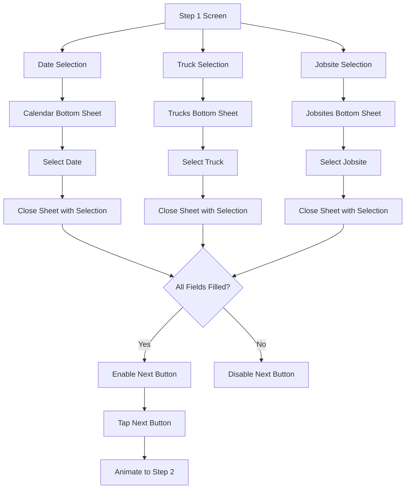

**Implementation Details:**
1. **Data Requirements**: Date, truck ID, and jobsite ID
2. **Bottom Sheet Components**: Custom implementation with Framer Motion
3. **API Call**: Creates/updates wizard state and validates fields
4. **Validation Rules**:
   - Date cannot be more than 5 days in the future
   - Truck and jobsite selections are required

**User Experience:**
1. User taps "New Ticket" from the tickets list screen
2. User sees form with three selection fields:
   - Each field displays placeholder text if not filled
   - Filled fields show the selected value
3. User taps a field to make a selection:
   - Bottom sheet slides up with appropriate choices
   - Sheet includes search functionality for long lists
   - Selection is confirmed with visual feedback
4. Once all fields are valid, "Next" button becomes enabled
5. Tapping "Next" triggers a rightward sliding animation to Step 2

### Step 2: Ticket Categories

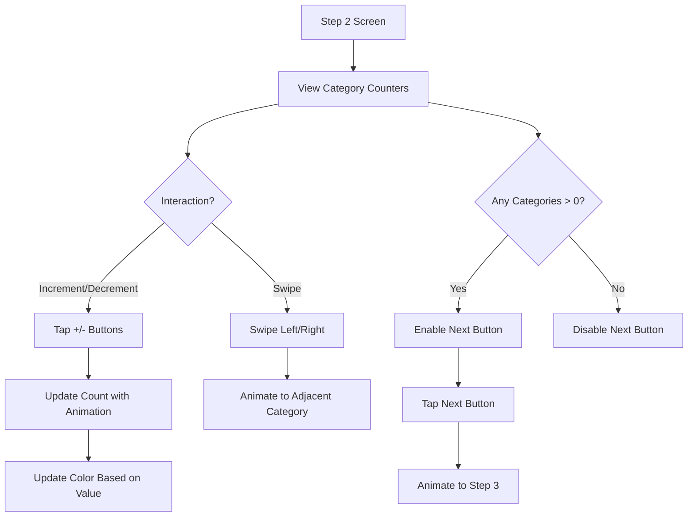

**Implementation Details:**
1. **Data Structure**: Six numeric values (0-150) for different ticket categories
2. **Interactive Components**: 
   - Animated counters with color transitions
   - Swipeable category cards
3. **Color Feedback**:
   - 0: Red
   - 1-84: Yellow
   - 85-124: Green
   - 125-150: Gold
4. **Validation Rule**: At least one category must have a value greater than 0

**User Experience:**
1. User sees categories with counter UI:
   - "Hangers" category displayed first
   - Counter starts at 0 (red)
   - + and - buttons on either side
2. User interacts with counters:
   - Tapping + increments value with animation
   - Value changes color based on thresholds
   - At value boundaries (0, 85, 125), haptic feedback occurs
3. User can swipe left/right to navigate between categories
   - Smooth physics-based transition animation
   - Progress indicator shows current category position
4. Once at least one counter has a value > 0, "Next" button is enabled
5. Tapping "Next" transitions to Step 3 with animation

### Step 3: Image Upload

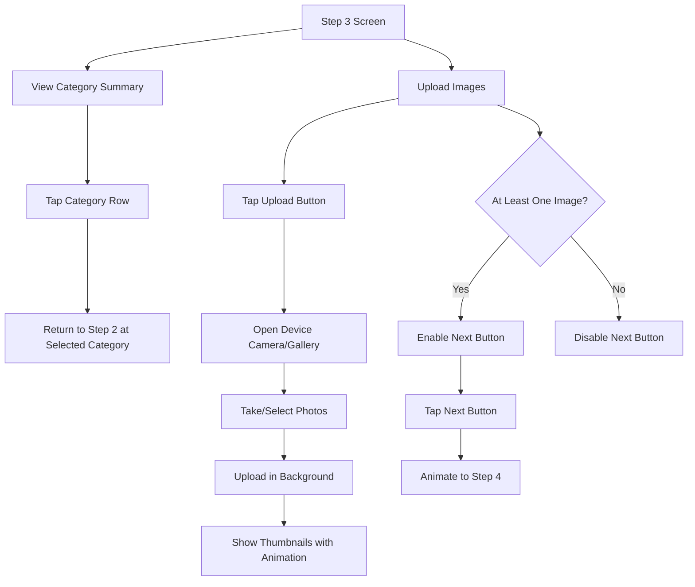

**Implementation Details:**
1. **File Handling**:
   - Images stored in temporary Firebase Storage
   - Maximum 10 images per ticket, 10MB per image
   - Supported formats: JPEG, PNG, WebP
2. **API Endpoint**: `POST /api/tickets/images/temp`
3. **Validation Rule**: At least one image required

**User Experience:**
1. User sees two main sections:
   - Category summary at top (all non-zero categories)
   - Image upload area below
2. Category summary allows quick edits:
   - Tapping a category row returns to Step 2 for that category
   - Camera icon brings user back to Step 3 after editing
3. Image upload interface:
   - Grid of thumbnails for uploaded images
   - "Add Photos" button opens camera/gallery
   - Upload progress indicator for each image
   - Images appear with scale animation when uploaded
4. User can tap thumbnails to preview full-size image
5. User can remove images by tapping "X" on thumbnails
6. Once at least one image is uploaded, "Next" button is enabled
7. Tapping "Next" transitions to Step 4 with animation

### Step 4: Confirmation & Submission

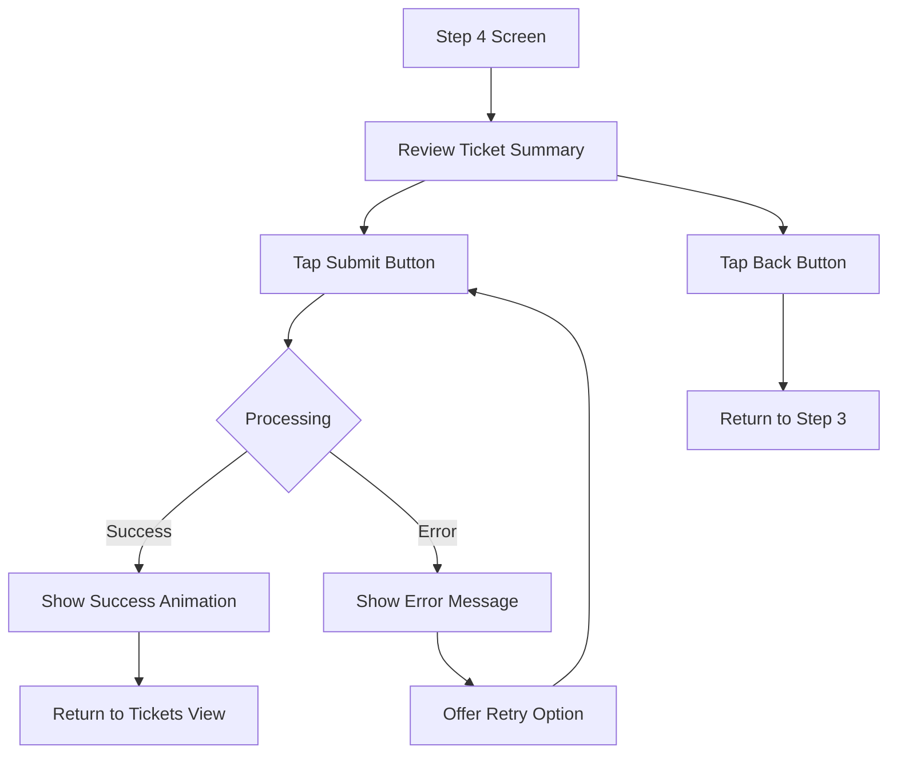

**Implementation Details:**
1. **Final Processing**:
   - Move images from temporary to permanent storage
   - Create ticket record in Firestore
   - Create or update workday record to "full" for the same date
   - Delete wizard state
2. **API Endpoint**: `POST /api/tickets/wizard/complete`
3. **Success Animation**: Custom animation with Framer Motion
4. **Workday Integration**: 
   ```json
   {
     "date": "same as ticket date",
     "jobsite": "same as ticket jobsite",
     "workType": "full",
     "autoCreated": true
   }
   ```

**User Experience:**
1. User sees complete summary of ticket information:
   - Basic info (date, truck, jobsite)
   - Category counts with appropriate colors
   - Thumbnail grid of uploaded images
2. User reviews information for accuracy
3. User taps "Submit" button:
   - Button shows loading state
   - Upload progress indicator appears
4. On successful submission:
   - Success animation plays with haptic feedback
   - Brief notification indicates: "Full workday automatically logged"
   - "Done" button appears to return to tickets list
5. On error:
   - Error message appears with explanation
   - "Retry" button allows reattempting submission
   - "Back" button allows returning to previous steps

## Session Recovery Flow

If a user closes the app during ticket submission, the system provides a limited recovery mechanism.

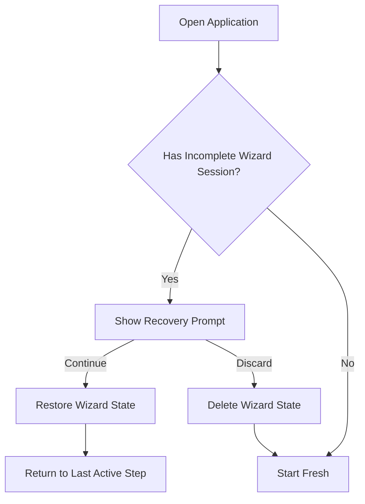

**Implementation Note**: Session recovery functionality is currently in development and may be enhanced in future updates.

**User Experience:**
1. If user had an incomplete wizard session:
   - Dialog appears on next app open
   - Shows how far they progressed (e.g., "Step 2 of 4")
   - Offers options to continue or discard
2. If user chooses to continue:
   - Wizard reopens at the last active step
   - All previously entered data is restored
   - User can continue from where they left off
3. If user chooses to discard:
   - Wizard state is deleted
   - Fresh start from calendar view

## Viewing Historical Data

### Ticket History View

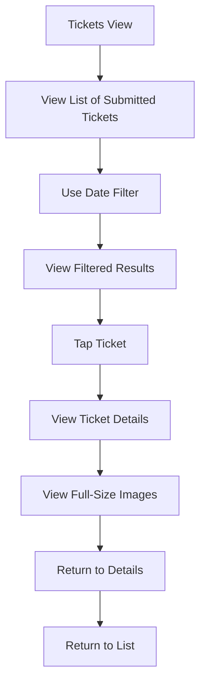

**Implementation Details:**
1. **API Endpoint**: `GET /api/tickets?startDate={startDate}&endDate={endDate}`
2. **Data Loading**: React Query with pagination
3. **Image Handling**: Thumbnails for list, full-size for details view

**User Experience:**
1. User accesses the Tickets view by tapping the "Tickets" button in the top right of the Calendar
2. List of tickets appears, sorted by date (newest first)
3. User can filter by date range:
   - Date picker allows selecting range
   - Results update automatically
4. Each ticket shows:
   - Date
   - Truck nickname
   - Jobsite name
   - Total ticket count
   - Small thumbnail preview
5. Tapping a ticket opens detailed view:
   - All category counts with appropriate colors
   - Larger image thumbnails in grid
   - Basic information section at top
6. Tapping an image opens full-screen view:
   - Swipe between multiple images
   - Pinch to zoom functionality
   - Close button returns to details

### Workday History View

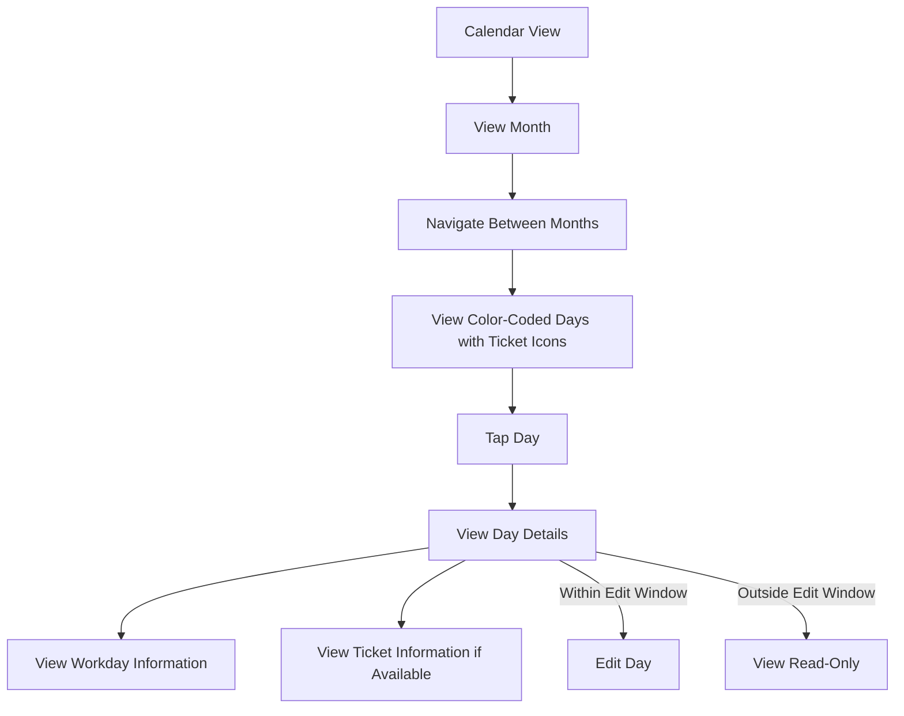

**Implementation Details:**
1. **API Endpoint**: `GET /api/workdays?startDate={startDate}&endDate={endDate}`
2. **Data Loading**: React Query with date-based caching
3. **Edit Window**: 7 days from submission date
4. **Ticket Integration**: Join data from tickets collection for same date

**User Experience:**
1. User is automatically presented with the Calendar view after login
2. Month view appears with current month:
   - Days color-coded by work type
   - Days with ticket submissions show a small ticket icon
   - Current day highlighted
3. User can navigate between months:
   - Arrows at top of calendar
   - Month/year displayed between arrows
4. Tapping a day shows details:
   - Date in header
   - Jobsite name
   - Work type with color indicator
   - Submission date
   - Edit status (editable or locked)
   - If tickets exist: Ticket summary with total count and categories
5. If within edit window, "Edit" button is available
6. If outside edit window, view is read-only

## Related Resources

- [[1. Core Documentation/Technical_Specifications|Technical Specifications]]: High-level technical architecture
- [[2. Frontend Documentation/Frontend_Architecture|Frontend Architecture]]: Detailed frontend design
- [[2. Frontend Documentation/Component_Library_Design_System|Component Library & Design System]]: UI components used in flows
- [[3. Backend Documentation/API_Reference|API Reference]]: Complete API endpoint details
- [[3. Backend Documentation/Data_Models_Schema|Data Models & Schema]]: Data structures supporting these flows
- [[1. Core Documentation/Admin_Flows|Admin Flows]]: Administrator workflows

## Document Information

**Status:** Draft  
**Last Updated:** 2025-03-13  
**Author/Maintainer:** Development Team
