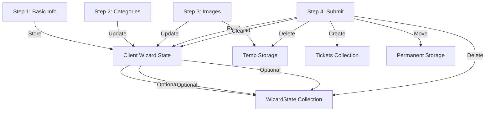

# Data Models & Schema

## Overview

This document describes the data models and schema design for the Workday & Ticket Tracking PWA. It covers the Firestore collections, their field structures, relationships between collections, and the indexing strategy. This documentation serves as a reference for developers working with the application's data layer.

## Table of Contents

```table-of-contents
```

## Database Overview

The application uses Firebase Firestore, a NoSQL document database, to store all application data. The database is organized into collections of documents, each with its own schema structure. 

Key design considerations include:

1. **Document-based Design**: Data is organized into collections of documents for flexibility and scalability
2. **Denormalization**: Some data is denormalized for performance optimization
3. **Nested Data**: Limited use of nested data to maintain query flexibility
4. **Reference Model**: Collections reference each other via document IDs
5. **Archiving Strategy**: Metadata-driven approach to data archiving
6. **Wizard State Management**: Support for multi-step form progression and validation

## Collections

### Users Collection

Stores employee and admin account information.

#### Schema

| Field | Type | Description | Required | Indexed |
|-------|------|-------------|----------|---------|
| `username` | `string` | Document ID, unique login identifier (e.g., "johndoe") | Yes | Yes |
| `role` | `string` | Either "employee" or "admin" | Yes | Yes |
| `createdAt` | `Timestamp` | When the user was created | Yes | No |
| `createdBy` | `string` | Admin who created the user | Yes | No |
| `updatedAt` | `Timestamp` | When the user was last updated | No | No |
| `updatedBy` | `string` | Admin who last updated the user | No | No |
| `animationPrefs` | `object` | User animation preferences | No | No |

#### TypeScript Interface

```typescript
interface User {
  username: string; // Document ID
  role: "employee" | "admin";
  createdAt: Timestamp;
  createdBy: string; // Admin who created the user
  updatedAt?: Timestamp;
  updatedBy?: string; // Admin who last updated the user
  animationPrefs?: {
    reducedMotion?: boolean; // Override system settings
    hapticFeedback?: boolean; // Enable/disable haptic feedback
  };
}
```

#### Example Document

```json
{
  "username": "johndoe",
  "role": "employee",
  "createdAt": {
    "_seconds": 1677609600,
    "_nanoseconds": 0
  },
  "createdBy": "admin1",
  "animationPrefs": {
    "reducedMotion": false,
    "hapticFeedback": true
  }
}
```

### Jobsites Collection

Stores predefined locations that are managed by admins.

#### Schema

| Field | Type | Description | Required | Indexed |
|-------|------|-------------|----------|---------|
| `id` | `string` | Document ID, unique identifier (e.g., "site-5") | Yes | Yes |
| `name` | `string` | Display name (e.g., "Downtown HQ") | Yes | No |
| `createdAt` | `Timestamp` | When the jobsite was created | Yes | No |
| `createdBy` | `string` | Admin who created the jobsite | Yes | No |
| `updatedAt` | `Timestamp` | When the jobsite was last updated | No | No |
| `updatedBy` | `string` | Admin who last updated the jobsite | No | No |

#### TypeScript Interface

```typescript
interface Jobsite {
  id: string; // Document ID
  name: string;
  createdAt: Timestamp;
  createdBy: string;
  updatedAt?: Timestamp;
  updatedBy?: string;
}
```

#### Example Document

```json
{
  "id": "site-5",
  "name": "Downtown HQ",
  "createdAt": {
    "_seconds": 1677609600,
    "_nanoseconds": 0
  },
  "createdBy": "admin1"
}
```

### Trucks Collection

Stores truck information for ticket assignments.

#### Schema

| Field | Type | Description | Required | Indexed |
|-------|------|-------------|----------|---------|
| `id` | `string` | Document ID, unique identifier (e.g., "Truck-12") | Yes | Yes |
| `nickname` | `string` | Display name (e.g., "Big Blue") | Yes | No |
| `isActive` | `boolean` | Whether truck is currently in use | Yes | Yes |
| `createdAt` | `Timestamp` | When the truck was created | Yes | No |
| `createdBy` | `string` | Admin who created the truck | Yes | No |
| `updatedAt` | `Timestamp` | When the truck was last updated | No | No |
| `updatedBy` | `string` | Admin who last updated the truck | No | No |

#### TypeScript Interface

```typescript
interface Truck {
  id: string; // Document ID
  nickname: string;
  isActive: boolean;
  createdAt: Timestamp;
  createdBy: string;
  updatedAt?: Timestamp;
  updatedBy?: string;
}
```

#### Example Document

```json
{
  "id": "Truck-12",
  "nickname": "Big Blue",
  "isActive": true,
  "createdAt": {
    "_seconds": 1677609600,
    "_nanoseconds": 0
  },
  "createdBy": "admin1"
}
```

### Workdays Collection

Tracks daily work status (full/half/off days).

#### Schema

| Field | Type | Description | Required | Indexed |
|-------|------|-------------|----------|---------|
| `userId` | `string` | Links to `users.username` | Yes | Yes |
| `date` | `Timestamp` | Date of workday (e.g., `2024-10-05`) | Yes | Yes |
| `jobsite` | `string` | Matches `jobsites.id` | Yes | Yes |
| `workType` | `string` | `"full"`, `"half"`, or `"off"` | Yes | No |
| `submissionDate` | `Timestamp` | Initial submission timestamp | Yes | No |
| `editableUntil` | `Timestamp` | `submissionDate + 7 days` | Yes | Yes |
| `isFuturePrediction` | `boolean` | Flag for dates in the future | Yes | Yes |
| `archiveStatus` | `string` | `"active"` or `"fully_archived"` | Yes | Yes |
| `archiveDate` | `Timestamp` | When record was archived (if applicable) | No | No |
| `archiveFile` | `string` | GCS URL to Excel archive (if archived) | No | No |
| `archiveRow` | `number` | Row number in archive Excel file | No | No |

#### TypeScript Interface

```typescript
interface Workday {
  userId: string;
  date: Timestamp;
  jobsite: string;
  workType: "full" | "half" | "off";
  submissionDate: Timestamp;
  editableUntil: Timestamp;
  isFuturePrediction: boolean;
  archiveStatus: 'active' | 'fully_archived';
  archiveDate?: Timestamp;
  archiveFile?: string;
  archiveRow?: number;
}
```

#### Example Document

```json
{
  "userId": "johndoe",
  "date": {
    "_seconds": 1696464000,
    "_nanoseconds": 0
  },
  "jobsite": "site-5",
  "workType": "full",
  "submissionDate": {
    "_seconds": 1696550400,
    "_nanoseconds": 0
  },
  "editableUntil": {
    "_seconds": 1697155200,
    "_nanoseconds": 0
  },
  "isFuturePrediction": false,
  "archiveStatus": "active"
}
```

### Tickets Collection

Stores ticket submissions with images.

#### Schema

| Field | Type | Description | Required | Indexed |
|-------|------|-------------|----------|---------|
| `userId` | `string` | Links to `users.username` | Yes | Yes |
| `date` | `Timestamp` | Date of ticket submission | Yes | Yes |
| `truckNumber` | `string` | Matches `trucks.id` | Yes | Yes |
| `truckNickname` | `string` | Display name from `trucks` collection | Yes | No |
| `jobsite` | `string` | Matches `jobsites.id` | Yes | Yes |
| `hangers` | `number` | Ticket count (0-150) | Yes | Yes |
| `leaner6To12` | `number` | Ticket count (0-150) | Yes | No |
| `leaner13To24` | `number` | Ticket count (0-150) | Yes | No |
| `leaner25To36` | `number` | Ticket count (0-150) | Yes | No |
| `leaner37To48` | `number` | Ticket count (0-150) | Yes | No |
| `leaner49Plus` | `number` | Ticket count (0-150) | Yes | No |
| `total` | `number` | Auto-sum of all ticket categories | Yes | No |
| `images` | `string[]` | Firebase Storage URLs (active images) | Yes | No |
| `thumbnails` | `string[]` | Thumbnail image URLs for previews | No | No |
| `submissionDate` | `Timestamp` | When ticket was submitted | Yes | No |
| `isFuturePrediction` | `boolean` | Flag for dates in the future | Yes | Yes |
| `archiveStatus` | `string` | `"active"`, `"images_archived"`, or `"fully_archived"` | Yes | Yes |
| `archiveDate` | `Timestamp` | When record/images were archived | No | No |
| `archivedImages` | `string[]` | Cloud Storage URLs for archived images | No | No |
| `archiveFile` | `string` | GCS URL to Excel archive (if fully archived) | No | No |
| `archiveRow` | `number` | Row number in archive Excel file | No | No |

#### TypeScript Interface

```typescript
interface Ticket {
  userId: string;
  date: Timestamp;
  truckNumber: string;
  truckNickname: string;
  jobsite: string;
  hangers: number;
  leaner6To12: number;
  leaner13To24: number;
  leaner25To36: number;
  leaner37To48: number;
  leaner49Plus: number;
  total: number;
  images: string[];
  thumbnails?: string[];
  submissionDate: Timestamp;
  isFuturePrediction: boolean;
  archiveStatus: 'active' | 'images_archived' | 'fully_archived';
  archiveDate?: Timestamp;
  archivedImages?: string[];
  archiveFile?: string;
  archiveRow?: number;
}
```

#### Example Document

```json
{
  "userId": "johndoe",
  "date": {
    "_seconds": 1696464000,
    "_nanoseconds": 0
  },
  "truckNumber": "Truck-12",
  "truckNickname": "Big Blue",
  "jobsite": "site-5",
  "hangers": 120,
  "leaner6To12": 45,
  "leaner13To24": 30,
  "leaner25To36": 15,
  "leaner37To48": 5,
  "leaner49Plus": 0,
  "total": 215,
  "images": [
    "gs://workday-tracker-prod.appspot.com/tickets/johndoe/abc123/image1.jpg",
    "gs://workday-tracker-prod.appspot.com/tickets/johndoe/abc123/image2.jpg"
  ],
  "thumbnails": [
    "gs://workday-tracker-prod.appspot.com/tickets/johndoe/abc123/thumbnails/image1.jpg",
    "gs://workday-tracker-prod.appspot.com/tickets/johndoe/abc123/thumbnails/image2.jpg"
  ],
  "submissionDate": {
    "_seconds": 1696464000,
    "_nanoseconds": 0
  },
  "isFuturePrediction": false,
  "archiveStatus": "active"
}
```

### ArchiveIndex Collection

Tracks archived data files for searchability.

#### Schema

| Field | Type | Description | Required | Indexed |
|-------|------|-------------|----------|---------|
| `id` | `string` | Unique ID (e.g., `"tickets-site5-2024-06"`) | Yes | Yes |
| `type` | `string` | `"tickets"` or `"workdays"` | Yes | Yes |
| `entityId` | `string` | Related jobsite/user ID | Yes | Yes |
| `archiveUrl` | `string` | GCS URL to Excel archive file | Yes | No |
| `recordCount` | `number` | Number of records in archive file | Yes | No |
| `cutoffDate` | `Timestamp` | Date threshold used for archiving | Yes | Yes |
| `createdAt` | `Timestamp` | When archive was created | Yes | No |

#### TypeScript Interface

```typescript
interface ArchiveIndex {
  id: string;
  type: 'tickets' | 'workdays';
  entityId: string;
  archiveUrl: string;
  recordCount: number;
  cutoffDate: Timestamp;
  createdAt: Timestamp;
}
```

#### Example Document

```json
{
  "id": "tickets-site5-2024-06",
  "type": "tickets",
  "entityId": "site-5",
  "archiveUrl": "gs://archive-bucket/archive/data/2024-06/tickets-site5-2024-06.xlsx",
  "recordCount": 325,
  "cutoffDate": {
    "_seconds": 1717200000,
    "_nanoseconds": 0
  },
  "createdAt": {
    "_seconds": 1720224000,
    "_nanoseconds": 0
  }
}
```

### WizardState Collection

Optionally stores in-progress ticket submission wizard state for user session recovery. This is primarily managed in client state (Zustand) but can be persisted for session recovery.

#### Schema

| Field | Type | Description | Required | Indexed |
|-------|------|-------------|----------|---------|
| `id` | `string` | Unique ID (e.g., `"wizard-johndoe-1720224000"`) | Yes | Yes |
| `userId` | `string` | Links to `users.username` | Yes | Yes |
| `createdAt` | `Timestamp` | When wizard session started | Yes | No |
| `updatedAt` | `Timestamp` | When wizard state was last updated | Yes | No |
| `currentStep` | `number` | Current wizard step (1-4) | Yes | No |
| `basicInfo` | `object` | Step 1 data (date, truck, jobsite) | No | No |
| `categories` | `object` | Step 2 data (ticket counts) | No | No |
| `imageData` | `object` | Step 3 data (image references, not actual images) | No | No |
| `stepValidation` | `object` | Validation state for each step | No | No |
| `expiresAt` | `Timestamp` | When this draft state expires | Yes | Yes |

#### TypeScript Interface

```typescript
interface WizardState {
  id: string;
  userId: string;
  createdAt: Timestamp;
  updatedAt: Timestamp;
  currentStep: 1 | 2 | 3 | 4;
  basicInfo?: {
    date: Timestamp;
    truckNumber: string;
    jobsite: string;
  };
  categories?: {
    hangers: number;
    leaner6To12: number;
    leaner13To24: number;
    leaner25To36: number;
    leaner37To48: number;
    leaner49Plus: number;
  };
  imageData?: {
    imageRefs: string[];
    tempUrls: string[];
  };
  stepValidation: {
    step1Valid: boolean;
    step2Valid: boolean;
    step3Valid: boolean;
  };
  expiresAt: Timestamp; // 24 hours after creation by default
}
```

#### Example Document

```json
{
  "id": "wizard-johndoe-1720224000",
  "userId": "johndoe",
  "createdAt": {
    "_seconds": 1720224000,
    "_nanoseconds": 0
  },
  "updatedAt": {
    "_seconds": 1720224300,
    "_nanoseconds": 0
  },
  "currentStep": 2,
  "basicInfo": {
    "date": {
      "_seconds": 1720137600,
      "_nanoseconds": 0
    },
    "truckNumber": "Truck-12",
    "jobsite": "site-5"
  },
  "categories": {
    "hangers": 120,
    "leaner6To12": 45,
    "leaner13To24": 30,
    "leaner25To36": 15,
    "leaner37To48": 5,
    "leaner49Plus": 0
  },
  "stepValidation": {
    "step1Valid": true,
    "step2Valid": false,
    "step3Valid": false
  },
  "expiresAt": {
    "_seconds": 1720310400,
    "_nanoseconds": 0
  }
}
```

## Export and Archive Data Models

### Exports Collection

Stores metadata for exports created by administrators.

#### Schema

| Field | Type | Description | Required | Indexed |
|-------|------|-------------|----------|---------|
| `id` | `string` | Document ID, unique identifier | Yes | Yes |
| `type` | `string` | Export type: "tickets" or "workdays" | Yes | Yes |
| `format` | `string` | Export format: "csv", "excel", or "json" | Yes | Yes |
| `url` | `string` | Download URL for the exported file | Yes | No |
| `filename` | `string` | Name of the exported file | Yes | No |
| `createdAt` | `Timestamp` | When the export was created | Yes | Yes |
| `expiresAt` | `Timestamp` | When the export URL will expire | Yes | Yes |
| `recordCount` | `number` | Number of records in the export | Yes | No |
| `status` | `string` | Export status: "completed", "processing", or "error" | Yes | Yes |
| `errorMessage` | `string` | Error message if status is "error" | No | No |
| `userId` | `string` | Admin who created the export | Yes | Yes |
| `storagePath` | `string` | Storage path for the exported file | No | No |
| `dateFrom` | `string` | Start date for data in the export (YYYY-MM-DD) | No | Yes |
| `dateTo` | `string` | End date for data in the export (YYYY-MM-DD) | No | Yes |

#### TypeScript Interface

```typescript
interface ExportItem {
  id: string;
  type: 'tickets' | 'workdays';
  format: 'csv' | 'excel' | 'json';
  url: string;
  filename: string;
  createdAt: Timestamp;
  expiresAt: Timestamp;
  recordCount: number;
  status: 'completed' | 'processing' | 'error';
  errorMessage?: string;
  userId: string;
  storagePath?: string;
  dateFrom?: string;
  dateTo?: string;
}
```

#### Example Document

```json
{
  "id": "export-tickets-20250324",
  "type": "tickets",
  "format": "excel",
  "url": "https://firebasestorage.googleapis.com/...",
  "filename": "tickets-export-2025-03-24.xlsx",
  "createdAt": {
    "_seconds": 1711339139,
    "_nanoseconds": 0
  },
  "expiresAt": {
    "_seconds": 1711425539,
    "_nanoseconds": 0
  },
  "recordCount": 156,
  "status": "completed",
  "userId": "admin1",
  "storagePath": "exports/tickets/tickets-export-2025-03-24.xlsx",
  "dateFrom": "2025-01-01",
  "dateTo": "2025-03-24"
}
```

### ArchiveIndex Collection

Stores metadata for archived data for efficient search and retrieval.

#### Schema

| Field | Type | Description | Required | Indexed |
|-------|------|-------------|----------|---------|
| `id` | `string` | Document ID, unique identifier | Yes | Yes |
| `originalId` | `string` | Original document ID in source collection | Yes | Yes |
| `type` | `string` | Archived item type: "ticket" or "workday" | Yes | Yes |
| `archivedAt` | `Timestamp` | When the item was archived | Yes | Yes |
| `archivedBy` | `string` | Admin who archived the item | Yes | No |
| `storagePath` | `string` | Path to archived data in storage | Yes | No |
| `status` | `string` | Archive status: "images_archived" or "fully_archived" | Yes | Yes |
| `metadata` | `object` | Key metadata from original document | Yes | No |
| `restoredAt` | `Timestamp` | When the item was restored (if applicable) | No | Yes |
| `restoredBy` | `string` | Admin who restored the item (if applicable) | No | No |

#### TypeScript Interface

```typescript
interface ArchiveIndex {
  id: string;
  originalId: string;
  type: 'ticket' | 'workday';
  archivedAt: Timestamp;
  archivedBy: string;
  storagePath: string;
  status: 'images_archived' | 'fully_archived';
  metadata: {
    date?: string;
    jobsiteId?: string;
    truckId?: string;
    userId?: string;
    totalCount?: number;
    // Additional metadata specific to the item type
  };
  restoredAt?: Timestamp;
  restoredBy?: string;
}
```

#### Example Document

```json
{
  "id": "archive-ticket-20240324",
  "originalId": "ticket-123456",
  "type": "ticket",
  "archivedAt": {
    "_seconds": 1711339139,
    "_nanoseconds": 0
  },
  "archivedBy": "admin1",
  "storagePath": "archives/tickets/ticket-123456.json",
  "status": "fully_archived",
  "metadata": {
    "date": "2025-01-15",
    "jobsiteId": "site-5",
    "truckId": "truck-3",
    "userId": "johndoe",
    "totalCount": 125
  }
}
```

## Storage Structure

### Export Storage

Export files are stored in Firebase Storage with the following structure:

```
exports/
  ├── tickets/
  │   ├── tickets-export-2025-03-24.xlsx
  │   ├── tickets-export-2025-03-24.csv
  │   └── tickets-export-2025-03-24.json
  └── workdays/
      ├── workdays-export-2025-03-24.xlsx
      ├── workdays-export-2025-03-24.csv
      └── workdays-export-2025-03-24.json
```

### Archive Storage

Archived data is stored in Firebase Storage with the following structure:

```
archives/
  ├── tickets/
  │   ├── ticket-123456.json
  │   └── ticket-images/
  │       ├── ticket-123456-01.jpg
  │       └── ticket-123456-02.jpg
  └── workdays/
      └── workday-789012.json
```

### Query Patterns

#### Export Queries

| Fields Indexed | Query Use Case |
|----------------|----------------|
| `userId` + `type` | Admin viewing their exports by type |
| `type` + `format` | Listing exports of a specific type and format |
| `status` | Filtering exports by status |
| `createdAt` | Sorting exports by creation date |
| `dateFrom` + `dateTo` | Filtering exports by date range |

#### Archive Queries

| Fields Indexed | Query Use Case |
|----------------|----------------|
| `type` + `status` | Filtering archives by type and status |
| `archivedAt` | Sorting archives by archive date |
| `originalId` | Finding specific archived items |
| `metadata.jobsiteId` | Filtering archives by jobsite |
| `metadata.userId` | Filtering archives by user |
| `restoredAt` | Filtering restored archives |

## Data Relationships

### One-to-Many Relationships

- `users.username` → `workdays.userId`: Each user can have multiple workday entries
- `users.username` → `tickets.userId`: Each user can submit multiple tickets
- `users.username` → `wizardState.userId`: Each user can have in-progress wizard sessions
- `jobsites.id` → `workdays.jobsite`: Each jobsite can be referenced in multiple workday entries
- `jobsites.id` → `tickets.jobsite`: Each jobsite can be referenced in multiple ticket submissions
- `trucks.id` → `tickets.truckNumber`: Each truck can be used in multiple ticket submissions

### Data Denormalization

The system uses strategic denormalization to improve read performance:

1. **Truck Nickname**: `tickets` includes `truckNickname` to avoid additional lookups when displaying tickets
2. **Totals**: `tickets` includes pre-calculated `total` field for all ticket categories
3. **Thumbnails**: `tickets` includes `thumbnails` array for optimized image previews
4. **Archive Status**: Both collections include `archiveStatus` to simplify filtering and queries

## Indexing Strategy

Firestore requires explicit indexes for compound queries. The following indexes are defined:

### `workdays` Collection

| Fields Indexed | Query Use Case |
|----------------|----------------|
| `userId` + `date` | Employee viewing their work history |
| `jobsite` + `date` | Admin filtering by location and date |
| `date` + `isFuturePrediction` | Filtering actual vs. projected workdays |
| `date` + `archiveStatus` | Finding records for archiving |
| `userId` + `archiveStatus` | Finding employee records to restore |

### `tickets` Collection

| Fields Indexed | Query Use Case |
|----------------|----------------|
| `date` + `truckNumber` | Admin filtering by date and truck |
| `date` + `jobsite` | Admin filtering by date and jobsite |
| `userId` + `date` | Employee viewing their ticket history |
| `truckNumber` + `isFuturePrediction` | Filtering actual vs. projected tickets |
| `date` + `archiveStatus` | Finding tickets for archiving |
| `jobsite` + `archiveStatus` | Jobsite-specific archive management |
| `userId` + `archiveStatus` | Employee-specific archive management |

### `archiveIndex` Collection

| Fields Indexed | Query Use Case |
|----------------|----------------|
| `type` + `entityId` | Finding archives for specific entity |
| `type` + `cutoffDate` | Finding archives for a time period |

### `wizardState` Collection

| Fields Indexed | Query Use Case |
|----------------|----------------|
| `userId` + `expiresAt` | Finding user's in-progress wizard sessions |
| `expiresAt` | Finding expired wizard sessions to clean up |

## Data Validation

The system implements validation at multiple levels to ensure data integrity:

### API-Level Validation (Zod Schemas)

```typescript
// Ticket submission schemas split by wizard step

// Step 1: Basic Info
const basicInfoSchema = z.object({
  date: z.date(),
  truckNumber: z.string().min(1, "Truck selection is required"),
  jobsite: z.string().min(1, "Jobsite is required"),
});

// Step 2: Categories
const categoriesSchema = z.object({
  hangers: z.number().min(0).max(150),
  leaner6To12: z.number().min(0).max(150),
  leaner13To24: z.number().min(0).max(150),
  leaner25To36: z.number().min(0).max(150),
  leaner37To48: z.number().min(0).max(150),
  leaner49Plus: z.number().min(0).max(150),
});

// Step 3: Images
const imagesSchema = z.object({
  images: z.array(z.instanceof(File)).min(1, "At least one image is required"),
});

// Combined schema for final submission
const ticketSchema = basicInfoSchema.merge(categoriesSchema).merge(imagesSchema);

// Custom validation for categories
const validateCategoriesStep = (data) => {
  // At least one ticket category must have a value
  const hasTickets = Object.values(data).some(val => 
    typeof val === 'number' && val > 0
  );
  
  if (!hasTickets) {
    return { success: false, message: "At least one ticket category must have a value" };
  }
  
  return { success: true };
};

// Custom validation for basic info
const validateBasicInfoStep = (data) => {
  // Check if date is too far in the future
  const maxDate = new Date();
  maxDate.setDate(maxDate.getDate() + 5);
  
  if (data.date > maxDate) {
    return { success: false, message: "Date cannot be more than 5 days in the future" };
  }
  
  return { success: true };
};
```

### Firestore Security Rules

Firestore security rules provide an additional layer of validation:

```
// Example for tickets collection
match /tickets/{ticketId} {
  allow create: if request.auth != null 
    && request.resource.data.userId == request.auth.uid
    && isValidTicketData(request.resource.data);
}

function isValidTicketData(data) {
  return data.hangers >= 0 && data.hangers <= 150
    && data.leaner6To12 >= 0 && data.leaner6To12 <= 150
    && data.leaner13To24 >= 0 && data.leaner13To24 <= 150
    && data.leaner25To36 >= 0 && data.leaner25To36 <= 150
    && data.leaner37To48 >= 0 && data.leaner37To48 <= 150
    && data.leaner49Plus >= 0 && data.leaner49Plus <= 150
    && data.total == (data.hangers + data.leaner6To12 + data.leaner13To24 
                    + data.leaner25To36 + data.leaner37To48 + data.leaner49Plus);
}
```

### Frontend Validation

Client-side validation provides immediate feedback using React Hook Form with Zod integration, plus specialized validation for the wizard flow.

## Ticket Submission Wizard Data Flow

The 4-step ticket submission wizard interacts with the data model in specific ways at each step:

### Step 1: Basic Information

- **Collects**: Date, truck selection, jobsite selection
- **Validates**: Required fields, future date restrictions
- **Stores**: Data in client-side wizard state (Zustand)
- **Optional**: Persists to `wizardState` collection for session recovery

### Step 2: Ticket Categories 

- **Collects**: Six category counts (0-150 each)
- **Validates**: At least one category must have value > 0, all values ≤ 150
- **Stores**: Data in client-side wizard state
- **Calculates**: Total ticket count across all categories
- **Optional**: Updates `wizardState` collection

### Step 3: Image Upload & Summary

- **Collects**: Image files and previews
- **Processes**: Uploads images to temporary Firebase Storage location
- **Creates**: Thumbnail versions for efficient loading
- **Stores**: Image references in client-side wizard state
- **Optional**: Updates `wizardState` collection with image references

### Step 4: Confirmation & Submission

- **Validates**: All required data is present and valid
- **Processes**: 
  1. Moves images from temporary to permanent storage location
  2. Creates thumbnails if not already created
  3. Creates the ticket record in Firestore
- **Cleanup**: Removes temporary wizard state if persisted

### Wizard State Management



## Related Resources

- [[3. Backend Documentation/Backend_Architecture|Backend Architecture]] - High-level system design
- [[3. Backend Documentation/Authentication_System|Authentication System]] - Authentication flow details
- [[3. Backend Documentation/API_Reference|API Reference]] - API endpoint specifications
- [[3. Backend Documentation/Data_Archiving|Data Archiving]] - Archiving process details
- [[3. Backend Documentation/Security_Implementation|Security Implementation]] - Security rules and patterns
- [[2. Frontend Documentation/State_Management|State Management]] - Wizard state management details 
- [[2. Frontend Documentation/Component_Library_Design_System|Component Library & Design System]] - Animation implementation
- [[2. Frontend Documentation/Frontend_Architecture|Frontend Architecture]] - Frontend architecture details

## Document Information

**Status:** Draft  
**Last Updated:** 2025-03-13  
**Author/Maintainer:** Development Team
