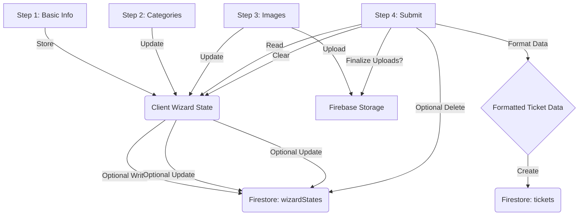

```markdown
---
status: Current
last_updated: 2025-04-05
author: Development Team
tags: [backend, data, schema, database, firestore]
---

# Data Models & Schema

## Overview

This document describes the data models and schema design for the Workday & Ticket Tracking PWA, reflecting the current state of the codebase as of the `last_updated` date. It covers the Firestore collections, their field structures, relationships between collections, and the indexing strategy. This documentation serves as a reference for developers working with the application's data layer.

## Table of Contents

```table-of-contents
```

## Database Overview

The application uses Firebase Firestore, a NoSQL document database, to store all application data. The database is organized into collections of documents.

**Base Structure:** Most data models extend a common `BaseEntity` structure providing:

* `id`: `string` (Auto-generated Firestore Document ID)
* `createdAt`: `Timestamp`
* `updatedAt`: `Timestamp`

Key design considerations include:

1. **Document-based Design**: Data is organized into collections of documents for flexibility and scalability.
2. **Denormalization**: Some data (e.g., names, counts) is denormalized for performance optimization.
3. **Reference Model**: Collections reference each other via document IDs (typically the auto-generated Firestore ID or Firebase Auth UID for users).
4. **Archiving Strategy**: Simplified status fields (`status` or `archiveStatus`) track the state of records.
5. **Wizard State Management**: Support for multi-step form progression via client-side state, with optional persistence for session recovery.

## Collections

### Users Collection (`users`)

Stores employee and admin account information, linked to Firebase Authentication.

#### Schema

| Field            | Type        | Description                                       | Required | Indexed |
| ---------------- | ----------- | ------------------------------------------------- | -------- | ------- |
| `id`             | `string`    | Document ID (Auto-generated or Firebase Auth UID) | Yes      | Yes     |
| `email`          | `string`    | User's login email                                | Yes      | Yes     |
| `displayName`    | `string`    | User's display name                               | Yes      | No      |
| `firstName`      | `string`    | User's first name                                 | No       | No      |
| `lastName`       | `string`    | User's last name                                  | No       | No      |
| `role`           | `string`    | `'admin'` or `'employee'`. **Note:** Authoritative RBAC is via Firebase Auth custom claims. This field is supplementary. | Yes      | Yes     |
| `status`         | `string`    | `'active'`, `'inactive'`, or `'pending'`          | No       | Yes     |
| `isActive`       | `boolean`   | Derived or specific active flag                   | No       | Yes     |
| `phoneNumber`    | `string`    | User's phone number                               | No       | No      |
| `lastLogin`      | `Timestamp` | Timestamp of the last login                       | No       | Yes     |
| `uid`            | `string`    | Firebase Auth UID (may be same as `id`)           | No       | Yes     |
| `username`       | `string`    | User's login username (Primary identifier)        | Yes      | Yes     |
| `passwordHash`   | `string`    | Bcrypt hash of the user's password                | Yes      | No      |
| `animationPrefs` | `map`       | User animation preferences                        | No       | No      |
| `deactivatedAt`  | `Timestamp` | Timestamp when user was deactivated               | No       | Yes     |
| `deactivatedBy`  | `string`    | Reference to admin user who deactivated           | No       | No      |
| `createdAt`      | `Timestamp` | When the user record was created                  | Yes      | Yes     |
| `updatedAt`      | `Timestamp` | When the user record was last updated             | Yes      | No      |

#### TypeScript Interface (`User` from `src/components/feature/admin/config/types.ts`)

```typescript
interface BaseEntity {
  id: string;
  createdAt: Date; // Note: Firestore Timestamps are often handled as Dates in client code
  updatedAt: Date;
}

interface User extends BaseEntity {
  email: string;
  displayName: string;
  firstName?: string;
  lastName?: string;
  role: 'admin' | 'employee'; // Note: Authoritative RBAC is via Firebase Auth custom claims.
  status?: 'active' | 'inactive' | 'pending';
  isActive?: boolean;
  phoneNumber?: string;
  lastLogin?: Date; // Firestore Timestamp
  uid?: string; // Firebase Auth UID
  username: string; // Primary login identifier
  passwordHash: string; // Bcrypt hash
  animationPrefs?: {
    reducedMotion?: boolean;
    hapticFeedback?: boolean;
    // Add other prefs as needed
  };
  deactivatedAt?: Date; // Firestore Timestamp
  deactivatedBy?: string; // User ID of admin
}
```

#### Example Document

```json
{
  "id": "auth_user_uid_123", // Matches Firebase Auth UID
  "email": "johndoe@example.com", // Still stored, but login uses username
  "username": "johndoe", // Primary login identifier
  "passwordHash": "$2b$10$abcdefghijklmnopqrstuvwxyzABCDEFG", // Example bcrypt hash
  "displayName": "John Doe",
  "firstName": "John",
  "lastName": "Doe",
  "role": "employee", // Supplementary role info
  "status": "active",
  "isActive": true,
  "phoneNumber": "555-1234",
  "lastLogin": { "_seconds": 1712379600, "_nanoseconds": 0 },
  "uid": "auth_user_uid_123", // Firebase Auth UID
  "animationPrefs": { "reducedMotion": false },
  "createdAt": { "_seconds": 1677609600, "_nanoseconds": 0 },
  "updatedAt": { "_seconds": 1712379600, "_nanoseconds": 0 }
}
```

### Jobsites Collection (`jobsites`)

Stores predefined work locations managed by admins.

#### Schema

| Field          | Type                   | Description                                        | Required | Indexed                          |
| -------------- | ---------------------- | -------------------------------------------------- | -------- | -------------------------------- |
| `id`           | `string`               | Document ID (Auto-generated)                       | Yes      | Yes                              |
| `name`         | `string`               | Display name (e.g., "Downtown HQ")                 | Yes      | No                               |
| `location`     | `string` or `GeoPoint` | Address or coordinates                             | Yes      | No (GeoPoint needs manual index) |
| `status`       | `string`               | `'active'`, `'inactive'`, or `'completed'`         | Yes      | Yes                              |
| `client`       | `string`               | Client associated with the jobsite                 | Yes      | No                               |
| `contactName`  | `string`               | Primary contact name                               | No       | No                               |
| `contactPhone` | `string`               | Primary contact phone                              | No       | No                               |
| `contactEmail` | `string`               | Primary contact email                              | No       | No                               |
| `notes`        | `string`               | Additional notes about the jobsite                 | No       | No                               |
| `lastUsed`     | `Timestamp`            | Timestamp when last referenced in a ticket/workday | No       | Yes                              |
| `createdAt`    | `Timestamp`            | When the jobsite was created                       | Yes      | Yes                              |
| `updatedAt`    | `Timestamp`            | When the jobsite was last updated                  | Yes      | No                               |

#### TypeScript Interface (`Jobsite` from `src/components/feature/admin/config/types.ts`)

```typescript
interface Jobsite extends BaseEntity {
  name: string;
  location: string; // Or GeoPoint type if used
  status: 'active' | 'inactive' | 'completed';
  client: string;
  contactName?: string;
  contactPhone?: string;
  contactEmail?: string;
  notes?: string;
  lastUsed?: Date; // Firestore Timestamp
}
```

#### Example Document

```json
{
  "id": "firestore_auto_id_abc",
  "name": "Downtown HQ",
  "location": "123 Main St, Anytown",
  "status": "active",
  "client": "Major Corp",
  "contactName": "Jane Smith",
  "contactPhone": "555-5678",
  "notes": "Main entrance on Elm St.",
  "lastUsed": { "_seconds": 1712379000, "_nanoseconds": 0 },
  "createdAt": { "_seconds": 1677609600, "_nanoseconds": 0 },
  "updatedAt": { "_seconds": 1712379000, "_nanoseconds": 0 }
}
```

### Trucks Collection (`trucks`)

Stores truck information used for ticket assignments.

#### Schema

| Field         | Type        | Description                                  | Required | Indexed |
| ------------- | ----------- | -------------------------------------------- | -------- | ------- |
| `id`          | `string`    | Document ID (Auto-generated)                 | Yes      | Yes     |
| `truckNumber` | `string`    | Unique vehicle identifier (e.g., "T-12")     | Yes      | Yes     |
| `nickname`    | `string`    | Display name (e.g., "Big Blue")              | Yes      | No      |
| `status`      | `string`    | `'active'`, `'inactive'`, or `'maintenance'` | Yes      | Yes     |
| `lastUsed`    | `Timestamp` | Timestamp when last referenced in a ticket   | No       | Yes     |
| `notes`       | `string`    | Additional notes about the truck             | No       | No      |
| `createdAt`   | `Timestamp` | When the truck was created                   | Yes      | Yes     |
| `updatedAt`   | `Timestamp` | When the truck was last updated              | Yes      | No      |

#### TypeScript Interface (`Truck` from `src/components/feature/admin/config/types.ts`)

```typescript
interface Truck extends BaseEntity {
  truckNumber: string;
  nickname: string;
  status: 'active' | 'inactive' | 'maintenance';
  lastUsed?: Date; // Firestore Timestamp
  notes?: string;
}
```

#### Example Document

```json
{
  "id": "firestore_auto_id_xyz",
  "truckNumber": "T-12",
  "nickname": "Big Blue",
  "status": "active",
  "lastUsed": { "_seconds": 1712378000, "_nanoseconds": 0 },
  "notes": "Needs oil change soon.",
  "createdAt": { "_seconds": 1677609600, "_nanoseconds": 0 },
  "updatedAt": { "_seconds": 1712378000, "_nanoseconds": 0 }
}
```

### Workdays Collection (`workdays`)

Tracks employee daily work status and hours.

#### Schema

| Field          | Type        | Description                                                    | Required | Indexed |
| -------------- | ----------- | -------------------------------------------------------------- | -------- | ------- |
| `id`           | `string`    | Document ID (Auto-generated)                                   | Yes      | Yes     |
| `userId`       | `string`    | Links to `users.id` or `users.uid`                             | Yes      | Yes     |
| `employeeName` | `string`    | Denormalized user display name                                 | No       | No      |
| `date`         | `Timestamp` | Date of workday                                                | Yes      | Yes     |
| `jobsite`      | `string`    | Links to `jobsites.id`                                         | Yes      | Yes     |
| `jobsiteName`  | `string`    | Denormalized jobsite name                                      | No       | No      |
| `workType`     | `string`    | `'regular'`, `'overtime'`, `'holiday'`, `'sick'`, `'vacation'` | Yes      | Yes     |
| `hours`        | `number`    | Number of hours worked/recorded                                | Yes      | No      |
| `notes`        | `string`    | Additional notes for the workday                               | No       | No      |
| `status`       | `string`    | `'active'` or `'archived'`                                     | Yes      | Yes     |
| `isPrediction` | `boolean`   | Flag for future projections vs actual entries                  | No       | Yes     |
| `createdAt`    | `Timestamp` | When the record was created                                    | Yes      | Yes     |
| `updatedAt`    | `Timestamp` | When the record was last updated                               | Yes      | No      |

#### TypeScript Interface (`Workday` from `src/components/feature/admin/config/types.ts`)

```typescript
interface Workday extends BaseEntity {
  userId: string;
  employeeName?: string; // Denormalized
  date: Date; // Firestore Timestamp
  jobsite: string; // Jobsite ID
  jobsiteName?: string; // Denormalized
  workType: 'regular' | 'overtime' | 'holiday' | 'sick' | 'vacation';
  hours: number;
  notes?: string;
  status: 'active' | 'archived';
  isPrediction?: boolean;
  // Backward compatibility fields might exist but aren't primary
}
```

#### Example Document

```json
{
  "id": "firestore_auto_id_1a2b",
  "userId": "auth_user_uid_123",
  "employeeName": "John Doe",
  "date": { "_seconds": 1712361600, "_nanoseconds": 0 }, // April 5, 2025
  "jobsite": "firestore_auto_id_abc",
  "jobsiteName": "Downtown HQ",
  "workType": "regular",
  "hours": 8,
  "notes": "Completed project phase 1.",
  "status": "active",
  "isPrediction": false,
  "createdAt": { "_seconds": 1712379600, "_nanoseconds": 0 },
  "updatedAt": { "_seconds": 1712379600, "_nanoseconds": 0 }
}
```

### Tickets Collection (`tickets`)

Stores ticket submissions, including categories and image references.

#### Schema

| Field            | Type        | Description                                                               | Required | Indexed                            |
| ---------------- | ----------- | ------------------------------------------------------------------------- | -------- | ---------------------------------- |
| `id`             | `string`    | Document ID (Auto-generated)                                              | Yes      | Yes                                |
| `date`           | `Timestamp` | Date of ticket submission                                                 | Yes      | Yes                                |
| `truckNumber`    | `string`    | Identifier of the truck used                                              | Yes      | Yes                                |
| `jobsiteName`    | `string`    | Denormalized jobsite name                                                 | No       | No                                 |
| `categories`     | `map`       | Key-value pairs of category ID/name and count (`{[key: string]: number}`) | Yes      | No (Index specific keys if needed) |
| `imageUrls`      | `array`     | Array of Firebase Storage URLs for images                                 | No       | No                                 |
| `notes`          | `string`    | Additional notes for the ticket                                           | No       | No                                 |
| `userId`         | `string`    | Links to `users.id` or `users.uid`                                        | No       | Yes                                |
| `truckNickname`  | `string`    | Denormalized truck nickname                                               | No       | No                                 |
| `jobsite`        | `string`    | Links to `jobsites.id`                                                    | No       | Yes                                |
| `total`          | `number`    | Auto-sum of all category counts                                           | No       | Yes                                |
| `imageCount`     | `number`    | Count of images attached                                                  | No       | Yes                                |
| `submissionDate` | `Timestamp` | Timestamp when ticket was submitted                                       | No       | Yes                                |
| `archiveStatus`  | `string`    | `'active'`, `'images_archived'`, or `'fully_archived'`                    | No       | Yes                                |
| `createdAt`      | `Timestamp` | When the record was created                                               | Yes      | Yes                                |
| `updatedAt`      | `Timestamp` | When the record was last updated                                          | Yes      | No                                 |

#### TypeScript Interface (`Ticket` from `src/components/feature/admin/config/types.ts`)

```typescript
interface Ticket extends BaseEntity {
  date: Date; // Firestore Timestamp
  truckNumber: string;
  jobsiteName?: string; // Denormalized
  categories: { [key: string]: number }; // Flexible categories
  imageUrls?: string[]; // Storage URLs
  notes?: string;
  userId?: string; // User ID
  truckNickname?: string; // Denormalized
  jobsite?: string; // Jobsite ID
  total?: number; // Calculated
  imageCount?: number; // Calculated
  submissionDate?: Date; // Firestore Timestamp
  archiveStatus?: 'active' | 'images_archived' | 'fully_archived';
  // Backward compatibility fields might exist but aren't primary
}
```

#### Example Document

```json
{
  "id": "firestore_auto_id_tkt1",
  "date": { "_seconds": 1712361600, "_nanoseconds": 0 }, // April 5, 2025
  "truckNumber": "T-12",
  "jobsiteName": "Downtown HQ",
  "categories": {
    "hangers": 120,
    "leaners_short": 45,
    "leaners_medium": 30,
    "leaners_long": 15
    // Categories can be added/removed dynamically
  },
  "imageUrls": [
    "gs://your-bucket/tickets/user123/tkt1/image1.jpg",
    "gs://your-bucket/tickets/user123/tkt1/image2.jpg"
  ],
  "notes": "Standard run.",
  "userId": "auth_user_uid_123",
  "truckNickname": "Big Blue",
  "jobsite": "firestore_auto_id_abc",
  "total": 210, // 120 + 45 + 30 + 15
  "imageCount": 2,
  "submissionDate": { "_seconds": 1712379600, "_nanoseconds": 0 },
  "archiveStatus": "active",
  "createdAt": { "_seconds": 1712379600, "_nanoseconds": 0 },
  "updatedAt": { "_seconds": 1712379600, "_nanoseconds": 0 }
}
```

### WizardState Collection (`wizardStates`)

Optionally stores in-progress ticket submission wizard state for user session recovery. Primarily managed in client state (e.g., Zustand).

#### Schema

| Field         | Type        | Description                                    | Required | Indexed |
| ------------- | ----------- | ---------------------------------------------- | -------- | ------- |
| `id`          | `string`    | Document ID (e.g., `userId` or Auto-generated) | Yes      | Yes     |
| `userId`      | `string`    | Links to `users.id` or `users.uid`             | Yes      | Yes     |
| `step1`       | `map`       | Data from Step 1 (date, jobsite, truck)        | No       | No      |
| `step2`       | `map`       | Data from Step 2 (categories array)            | No       | No      |
| `step3`       | `map`       | Data from Step 3 (image references/temp URLs)  | No       | No      |
| `currentStep` | `number`    | Current step number in the wizard              | Yes      | No      |
| `lastUpdated` | `Timestamp` | When the wizard state was last saved           | Yes      | Yes     |
| `expiresAt`   | `Timestamp` | When this draft state expires (e.g., 24 hours) | Yes      | Yes     |

#### TypeScript Interface (`WizardData` from `src/types/tickets.ts`)

```typescript
// Assuming Timestamp is handled as Date in client code
interface WizardData {
  // id and userId might be managed outside this specific type, e.g., as doc ID
  step1: {
    date: Date; // Firestore Timestamp
    jobsite: string; // Jobsite ID
    truck: string; // Truck ID or Number
  };
  step2: {
    categories: Array<{ id: string; name: string; count: number }>;
  };
  step3: {
    images: string[]; // Temporary URLs or references
  };
  currentStep: number;
  lastUpdated: Date; // Firestore Timestamp
  expiresAt: Date; // Firestore Timestamp
}
```

#### Example Document

```json
{
  "id": "auth_user_uid_123", // Using userId as doc ID
  "userId": "auth_user_uid_123",
  "currentStep": 2,
  "step1": {
    "date": { "_seconds": 1712361600, "_nanoseconds": 0 },
    "jobsite": "firestore_auto_id_abc",
    "truck": "T-12"
  },
  "step2": {
    "categories": [
      { "id": "hangers", "name": "Hangers", "count": 50 },
      { "id": "leaners_short", "name": "Leaners (Short)", "count": 10 }
    ]
  },
  // step3 would be populated in the next step
  "lastUpdated": { "_seconds": 1712380000, "_nanoseconds": 0 },
  "expiresAt": { "_seconds": 1712466400, "_nanoseconds": 0 } // 24 hours later
}
```

### Exports Collection (`exports`)

Stores metadata for data exports generated by administrators.

#### Schema

| Field          | Type        | Description                                                | Required | Indexed |
| -------------- | ----------- | ---------------------------------------------------------- | -------- | ------- |
| `id`           | `string`    | Document ID (Auto-generated)                               | Yes      | Yes     |
| `type`         | `string`    | Export type: `'tickets'` or `'workdays'`                   | Yes      | Yes     |
| `format`       | `string`    | Export format: `'csv'`, `'excel'`, or `'json'`             | Yes      | Yes     |
| `url`          | `string`    | Download URL for the exported file (signed URL)            | Yes      | No      |
| `filename`     | `string`    | Name of the exported file                                  | Yes      | No      |
| `createdAt`    | `Timestamp` | When the export process started                            | Yes      | Yes     |
| `expiresAt`    | `Timestamp` | When the download URL will expire                          | Yes      | Yes     |
| `recordCount`  | `number`    | Number of records included in the export                   | Yes      | No      |
| `status`       | `string`    | Export status: `'completed'`, `'processing'`, or `'error'` | Yes      | Yes     |
| `errorMessage` | `string`    | Error message if status is `'error'`                       | No       | No      |
| `userId`       | `string`    | Admin user ID who initiated the export                     | Yes      | Yes     |
| `storagePath`  | `string`    | Firebase Storage path for the exported file                | No       | No      |
| `dateFrom`     | `string`    | Start date filter used for the export (YYYY-MM-DD)         | No       | Yes     |
| `dateTo`       | `string`    | End date filter used for the export (YYYY-MM-DD)           | No       | Yes     |

#### TypeScript Interface (`ExportItem` from `src/lib/schemas/exportSchemas.ts`)

```typescript
// Assuming Timestamp is handled as Date in client code
interface ExportItem {
  id: string;
  type: 'tickets' | 'workdays';
  format: 'csv' | 'excel' | 'json';
  url: string;
  filename: string;
  createdAt: Date; // Firestore Timestamp
  expiresAt: Date; // Firestore Timestamp
  recordCount: number;
  status: 'completed' | 'processing' | 'error';
  errorMessage?: string;
  userId: string; // Admin User ID
  storagePath?: string;
  dateFrom?: string; // YYYY-MM-DD
  dateTo?: string; // YYYY-MM-DD
}
```

#### Example Document

```json
{
  "id": "export_auto_id_789",
  "type": "tickets",
  "format": "excel",
  "url": "https://storage.googleapis.com/...",
  "filename": "tickets-export-2025-04-05.xlsx",
  "createdAt": { "_seconds": 1712380200, "_nanoseconds": 0 },
  "expiresAt": { "_seconds": 1712466600, "_nanoseconds": 0 }, // +24 hours
  "recordCount": 156,
  "status": "completed",
  "userId": "admin_user_uid_456",
  "storagePath": "exports/tickets/tickets-export-2025-04-05.xlsx",
  "dateFrom": "2025-03-01",
  "dateTo": "2025-03-31"
}
```

### Archives Collection (`archives`)

Stores metadata for individual archived items (tickets, workdays, images).

#### Schema

| Field         | Type        | Description                                               | Required | Indexed                                 |
| ------------- | ----------- | --------------------------------------------------------- | -------- | --------------------------------------- |
| `id`          | `string`    | Document ID (Auto-generated)                              | Yes      | Yes                                     |
| `type`        | `string`    | Archived item type: `'ticket'`, `'workday'`, or `'image'` | Yes      | Yes                                     |
| `originalId`  | `string`    | Document ID of the item in its original collection        | Yes      | Yes                                     |
| `title`       | `string`    | Descriptive title for the archived item                   | Yes      | No                                      |
| `description` | `string`    | Optional longer description                               | No       | No                                      |
| `date`        | `Timestamp` | Relevant date of the original item (e.g., ticket date)    | Yes      | Yes                                     |
| `archivedAt`  | `Timestamp` | When the item was archived                                | Yes      | Yes                                     |
| `archivedBy`  | `string`    | User ID of the admin who archived the item                | Yes      | No                                      |
| `metadata`    | `map`       | Key metadata extracted from the original document         | No       | No (Index specific subfields if needed) |
| `status`      | `string`    | Archive status: `'archived'` or `'restored'`              | Yes      | Yes                                     |

#### TypeScript Interface (`ArchiveItem` from `src/lib/schemas/archiveSchemas.ts`)

```typescript
// Assuming Timestamp is handled as Date in client code
interface ArchiveItem {
  id: string; // Archive record ID
  type: 'ticket' | 'workday' | 'image';
  originalId: string; // ID from original collection
  title: string;
  description?: string;
  date: Date; // Firestore Timestamp (relevant date of original item)
  archivedAt: Date; // Firestore Timestamp
  archivedBy: string; // User ID
  metadata?: {
    // Store relevant fields like userId, jobsiteId, truckNumber, etc.
    [key: string]: any;
  };
  status: 'archived' | 'restored';
}
```

#### Example Document

```json
{
  "id": "archive_auto_id_pqr",
  "type": "ticket",
  "originalId": "firestore_auto_id_tkt1",
  "title": "Ticket - John Doe - 2025-04-05",
  "description": "Archived ticket from Downtown HQ.",
  "date": { "_seconds": 1712361600, "_nanoseconds": 0 }, // Date of original ticket
  "archivedAt": { "_seconds": 1712380500, "_nanoseconds": 0 },
  "archivedBy": "admin_user_uid_456",
  "metadata": {
    "userId": "auth_user_uid_123",
    "jobsiteId": "firestore_auto_id_abc",
    "truckNumber": "T-12",
    "total": 210,
    "imageCount": 2
  },
  "status": "archived"
}
```

## Storage Structure

Firebase Storage is used for storing user-uploaded files (ticket images) and generated exports/archives.

### Ticket Image Storage

```
tickets/{userId}/{ticketId}/
  ├── image1.jpg
  ├── image2.jpg
  └── thumbnails/
      ├── image1_thumb.jpg
      └── image2_thumb.jpg
```

*(Structure may vary based on implementation)*

### Export Storage

```
exports/{type}/
  ├── {filename}.xlsx
  ├── {filename}.csv
  └── {filename}.json
```

*(Example: `exports/tickets/tickets-export-2025-04-05.xlsx`)*

### Archive Storage

Individual archived items might store data directly in the `archives` collection's `metadata` field or reference separate storage files if data is large. Image archives might involve moving files.

```
archives/{type}/{originalId}/
  ├── data.json // If storing full original data separately
  └── images/
      ├── image1.jpg // Moved original images
      └── image2.jpg
```

*(Structure depends heavily on the specific archiving implementation)*

## Data Relationships

### References

- `workdays.userId` → `users.id` (or `users.uid`)
- `workdays.jobsite` → `jobsites.id`
- `tickets.userId` → `users.id` (or `users.uid`)
- `tickets.jobsite` → `jobsites.id`
- `tickets.truckNumber` → Relates to `trucks.truckNumber` (Querying might require indexing `truckNumber` on `trucks`)
- `wizardStates.userId` → `users.id` (or `users.uid`)
- `exports.userId` → `users.id` (Admin user)
- `archives.archivedBy` → `users.id` (Admin user)
- `archives.originalId` + `archives.type` → Relates to the original document in `tickets` or `workdays` collection.

### Data Denormalization

Strategic denormalization is used to improve read performance:

1. **Names**: `workdays` may store `employeeName`, `jobsiteName`. `tickets` may store `jobsiteName`, `truckNickname`.
2. **Calculated Fields**: `tickets` may store calculated `total` and `imageCount`.
3. **Status Fields**: Collections include `status` or `archiveStatus` for easier filtering.

## Indexing Strategy

Firestore requires explicit indexes for compound queries and `orderBy` clauses on different fields. Define indexes based on actual application query patterns. Common needs might include:

*(Note: This section requires knowledge of actual queries. Below are plausible examples based on the models.)*

### `users` Collection

| Fields Indexed         | Query Use Case                               |
| ---------------------- | -------------------------------------------- |
| `role` + `status`      | Filtering users by role and status           |
| `email`                | Looking up user by email                     |
| `lastLogin` (desc)     | Finding recently active users                |
| `status` + `createdAt` | Finding users by status, ordered by creation |

### `jobsites` Collection

| Fields Indexed      | Query Use Case                                |
| ------------------- | --------------------------------------------- |
| `status` + `name`   | Filtering jobsites by status, ordered by name |
| `client` + `status` | Finding active jobsites for a specific client |
| `lastUsed` (desc)   | Finding recently used jobsites                |

### `trucks` Collection

| Fields Indexed           | Query Use Case                                |
| ------------------------ | --------------------------------------------- |
| `status` + `truckNumber` | Filtering trucks by status, ordered by number |
| `lastUsed` (desc)        | Finding recently used trucks                  |
| `truckNumber`            | Looking up truck by its number                |

### `workdays` Collection

| Fields Indexed          | Query Use Case                             |
| ----------------------- | ------------------------------------------ |
| `userId` + `date`       | Employee viewing their work history        |
| `jobsite` + `date`      | Admin filtering by location and date       |
| `date` + `status`       | Filtering workdays by date and status      |
| `date` + `isPrediction` | Filtering actual vs. projected workdays    |
| `userId` + `status`     | Finding active/archived records for a user |
| `workType` + `date`     | Filtering by work type over a date range   |

### `tickets` Collection

| Fields Indexed                       | Query Use Case                                                   |
| ------------------------------------ | ---------------------------------------------------------------- |
| `userId` + `date`                    | Employee viewing their ticket history                            |
| `jobsite` + `date`                   | Admin filtering by jobsite and date                              |
| `truckNumber` + `date`               | Admin filtering by truck and date                                |
| `date` + `archiveStatus`             | Finding tickets for archiving/management                         |
| `submissionDate` (desc)              | Viewing most recent submissions                                  |
| `total` + `date`                     | Analyzing ticket totals over time                                |
| `categories.{category_key}` + `date` | Querying specific category counts (requires indexing map fields) |

### `wizardStates` Collection

| Fields Indexed           | Query Use Case                              |
| ------------------------ | ------------------------------------------- |
| `userId` + `lastUpdated` | Finding user's in-progress wizard sessions  |
| `expiresAt`              | Finding expired wizard sessions for cleanup |

### `exports` Collection

| Fields Indexed                  | Query Use Case                                   |
| ------------------------------- | ------------------------------------------------ |
| `userId` + `type`               | Admin viewing their exports by type              |
| `status` + `createdAt`          | Filtering exports by status, ordered by creation |
| `type` + `format` + `createdAt` | Listing specific export types/formats            |
| `expiresAt`                     | Finding expired exports for cleanup              |

### `archives` Collection

| Fields Indexed                | Query Use Case                                                               |
| ----------------------------- | ---------------------------------------------------------------------------- |
| `type` + `status`             | Filtering archives by type and status                                        |
| `archivedAt` (desc)           | Viewing most recent archives                                                 |
| `originalId` + `type`         | Finding the archive record for a specific original item                      |
| `date` + `type`               | Filtering archives by original item date and type                            |
| `metadata.userId` + `type`    | Finding archives related to a specific user (requires indexing map field)    |
| `metadata.jobsiteId` + `type` | Finding archives related to a specific jobsite (requires indexing map field) |

## Data Validation

Validation occurs at multiple levels:

### Frontend Validation (e.g., React Hook Form + Zod)

Client-side validation provides immediate user feedback during form input, especially in the multi-step wizard. Schemas should align with the TypeScript interfaces.

```typescript
// Example Zod schema fragments (adapt based on actual implementation)
import { z } from 'zod';

// Step 1: Basic Info (Wizard)
const wizardStep1Schema = z.object({
  date: z.date(), // Or z.string() if handling conversion
  jobsite: z.string().min(1, "Jobsite is required"),
  truck: z.string().min(1, "Truck is required"),
});

// Step 2: Categories (Wizard)
const categorySchema = z.object({
  id: z.string(),
  name: z.string(),
  count: z.number().min(0).max(999), // Adjust max as needed
});
const wizardStep2Schema = z.object({
  categories: z.array(categorySchema).min(1, "At least one category needed"),
}).refine(data => data.categories.some(cat => cat.count > 0), {
  message: "At least one category must have a count greater than 0",
  path: ["categories"], // Apply error to the array field
});

// Step 3: Images (Wizard)
const wizardStep3Schema = z.object({
  images: z.array(z.string()).min(1, "At least one image is required"), // Assuming URLs/refs stored
});

// Combined Ticket (for direct creation/update if applicable)
const ticketSchema = z.object({
  id: z.string().optional(), // BaseEntity
  createdAt: z.date().optional(),
  updatedAt: z.date().optional(),
  date: z.date(),
  truckNumber: z.string(),
  jobsiteName: z.string().optional(),
  categories: z.record(z.string(), z.number().min(0)), // Map validation
  imageUrls: z.array(z.string().url()).optional(),
  notes: z.string().optional(),
  userId: z.string().optional(),
  truckNickname: z.string().optional(),
  jobsite: z.string().optional(),
  total: z.number().optional(),
  imageCount: z.number().optional(),
  submissionDate: z.date().optional(),
  archiveStatus: z.enum(['active', 'images_archived', 'fully_archived']).optional(),
}).refine(data => {
    const calculatedTotal = Object.values(data.categories).reduce((sum, count) => sum + count, 0);
    // Allow for optional total or check if it matches calculation
    return data.total === undefined || data.total === calculatedTotal;
}, { message: "Total does not match sum of categories", path: ["total"] });
```

### Firestore Security Rules (`firestore.rules`)

Server-side validation enforces data integrity and authorization. Rules should check authentication, user roles, ownership, and data consistency based on the current schemas.

```firestore-rules
rules_version = '2';

service cloud.firestore {
  match /databases/{database}/documents {

    // Base function to check if user is authenticated
    function isAuthenticated() {
      return request.auth != null;
    }

    // Function to check if user has admin role (assumes role is in custom claims or user doc)
    function isAdmin() {
      // Example: Check custom claims (preferred)
      // return isAuthenticated() && request.auth.token.role == 'admin';
      // Example: Check user document (requires read access to user doc)
      return isAuthenticated() && get(/databases/$(database)/documents/users/$(request.auth.uid)).data.role == 'admin';
    }

    // Function to check if user is the owner of the document
    function isOwner(userId) {
      return isAuthenticated() && request.auth.uid == userId;
    }

    // --- Users ---
    match /users/{userId} {
      allow read: if isAuthenticated(); // Allow logged-in users to read profiles (adjust as needed)
      allow create: if isAdmin(); // Only admins can create users
      allow update: if isAdmin() || isOwner(userId); // Admins or owner can update
      allow delete: if isAdmin(); // Only admins can delete
      // Add validation for fields on write
    }

    // --- Jobsites ---
    match /jobsites/{jobsiteId} {
      allow read: if isAuthenticated();
      allow create, update, delete: if isAdmin(); // Only admins manage jobsites
      // Add validation for fields on write (e.g., status enum)
    }

    // --- Trucks ---
    match /trucks/{truckId} {
      allow read: if isAuthenticated();
      allow create, update, delete: if isAdmin(); // Only admins manage trucks
      // Add validation for fields on write (e.g., status enum)
    }

    // --- Workdays ---
    match /workdays/{workdayId} {
      allow read: if isAuthenticated(); // Allow users to read (filter on client-side) or restrict further
      allow create: if isAuthenticated(); // Allow logged-in users to create
      allow update: if isAdmin() || isOwner(request.resource.data.userId); // Admin or owner can update
      allow delete: if isAdmin();
      // Validation: Ensure userId matches auth.uid on create, check workType enum, hours range etc.
      // Example validation on create:
      // allow create: if isAuthenticated()
      //                 && request.resource.data.userId == request.auth.uid
      //                 && request.resource.data.workType in ['regular', 'overtime', 'holiday', 'sick', 'vacation']
      //                 && request.resource.data.hours > 0 && request.resource.data.hours <= 24;
    }

    // --- Tickets ---
    match /tickets/{ticketId} {
      allow read: if isAuthenticated(); // Allow users to read (filter on client-side)
      allow create: if isAuthenticated(); // Allow logged-in users to create
      allow update: if isAdmin() || isOwner(request.resource.data.userId); // Admin or owner can update
      allow delete: if isAdmin();
      // Validation: Ensure userId matches auth.uid on create (if present), validate categories map, check total calculation, imageCount etc.
      // Example validation on create:
      // function isValidTicketCategories(categories) {
      //   return categories.keys().size() > 0 // At least one category
      //          && categories.values().forall(count, count >= 0 && count <= 999); // All counts valid
      // }
      // allow create: if isAuthenticated()
      //                 && (request.resource.data.userId == null || request.resource.data.userId == request.auth.uid)
      //                 && isValidTicketCategories(request.resource.data.categories)
      //                 && request.resource.data.total == request.resource.data.categories.values().sum(); // Validate total
    }

    // --- WizardStates ---
    match /wizardStates/{userId} {
      allow read, write: if isOwner(userId); // Only owner can manage their wizard state
      // Add validation for expiresAt, currentStep range etc.
    }

    // --- Exports ---
    match /exports/{exportId} {
      allow read: if isAdmin(); // Only admins can see export records
      allow create, update, delete: if isAdmin(); // Only admins manage exports
      // Add validation for type, format, status enums
    }

    // --- Archives ---
    match /archives/{archiveId} {
      allow read: if isAdmin(); // Only admins can see archive records
      allow create, update, delete: if isAdmin(); // Only admins manage archives
      // Add validation for type, status enums
    }
  }
}
```

## Ticket Submission Wizard Data Flow

The multi-step ticket submission wizard uses client-side state (e.g., Zustand) and interacts with Firestore primarily on final submission. Optional persistence to `wizardStates` can allow session recovery.

### Step 1: Basic Information

* **Collects**: Date, Jobsite (ID), Truck (Number/ID)
* **Validates**: Required fields, date constraints.
* **Stores**: In client state (`wizardStore.step1`).
* **Optional**: Persist to `wizardStates/{userId}`.

### Step 2: Ticket Categories

* **Collects**: Counts for defined categories (structure likely fetched from config/backend). Stored as an array of objects (`{id, name, count}`) in client state.
* **Validates**: At least one category > 0, individual counts within limits.
* **Stores**: In client state (`wizardStore.step2`).
* **Optional**: Update `wizardStates/{userId}`.

### Step 3: Image Upload

* **Collects**: Image files.
* **Processes**: Uploads images to temporary or final Firebase Storage location. Generates previews.
* **Stores**: Image references (e.g., temporary URLs, file names, or final URLs) in client state (`wizardStore.step3`).
* **Optional**: Update `wizardStates/{userId}`.

### Step 4: Confirmation & Submission

* **Validates**: All steps completed and valid.
* **Processes**:
  1. Consolidates data from client state (`wizardStore`).
  2. Transforms category array into the `categories` map (`{[key: string]: number}`) for Firestore.
  3. Calculates `total` and `imageCount`.
  4. Ensures images are in permanent storage location if temporary upload was used.
  5. Creates the final document in the `tickets` collection.
* **Cleanup**: Clears client state (`wizardStore`). Removes persisted `wizardStates/{userId}` document if it exists. Removes temporary images if applicable.

### Wizard State Management Diagram


```mermaid
flowchart TD
    A[Step 1: Basic Info] -->|Store| B(Client Wizard State);
    B -->|Optional Write| C(Firestore: wizardStates);
    D[Step 2: Categories] -->|Update| B;
    B -->|Optional Update| C;
    E[Step 3: Images] -->|Update| B;
    E -->|Upload| F[Firebase Storage];
    B -->|Optional Update| C;
    G[Step 4: Submit] -->|Read| B;
    G -->|Format Data| H{Formatted Ticket Data};
    H -->|Create| I(Firestore: tickets);
    G -->|Finalize Uploads?| F;
    G -->|Clear| B;
    G -->|Optional Delete| C;
```

## Related Resources

*(Review and update links if necessary based on current documentation structure)*

- [[3. Backend Documentation/Backend_Architecture|Backend Architecture]] - High-level system design
- [[3. Backend Documentation/Authentication_System|Authentication System]] - Authentication flow details
- [[3. Backend Documentation/API_Reference|API Reference]] - API endpoint specifications
- [[3. Backend Documentation/Data_Archiving|Data Archiving]] - Archiving process details
- [[3. Backend Documentation/Security_Implementation|Security Implementation]] - Security rules and patterns
- [[2. Frontend Documentation/State_Management|State Management]] - Wizard state management details
- [[2. Frontend Documentation/Component_Library_Design_System|Component Library & Design System]] - Animation implementation
- [[2. Frontend Documentation/Frontend_Architecture|Frontend Architecture]] - Frontend architecture details

## Document Information

**Status:** Current
**Last Updated:** 2025-04-05
**Author/Maintainer:** Development Team

```ag-0-1inn71m47ag-1-1inn71m47

```
